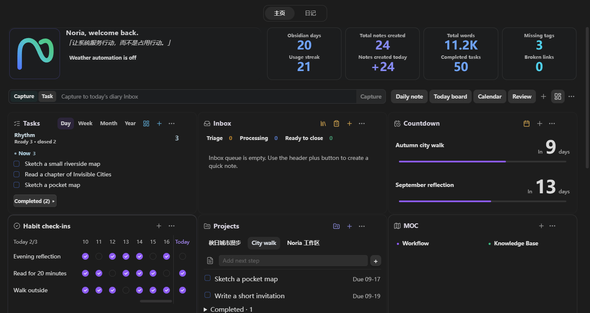
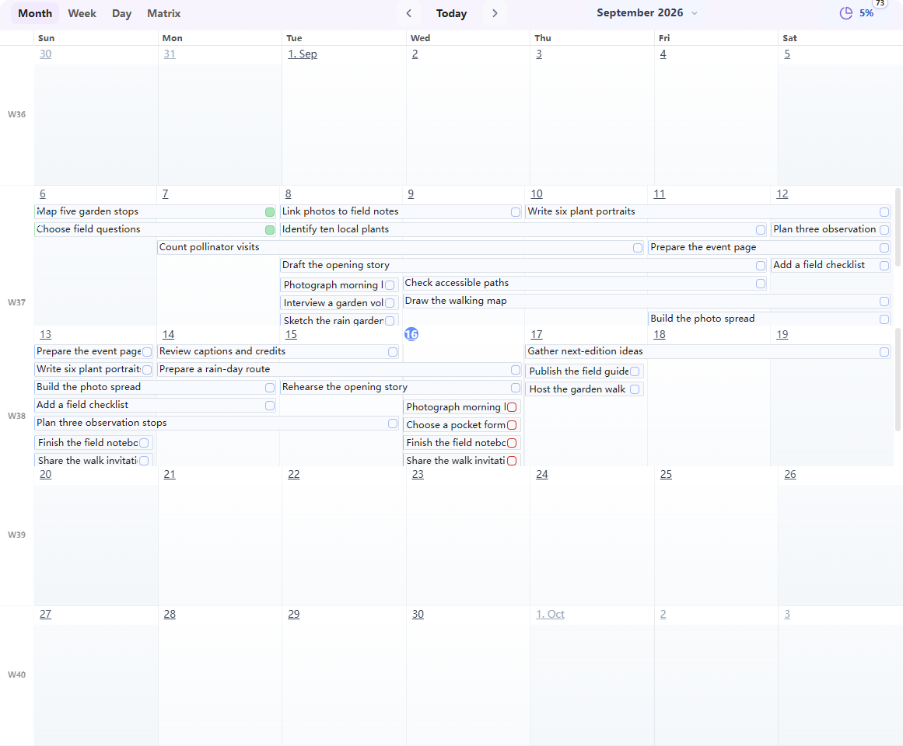
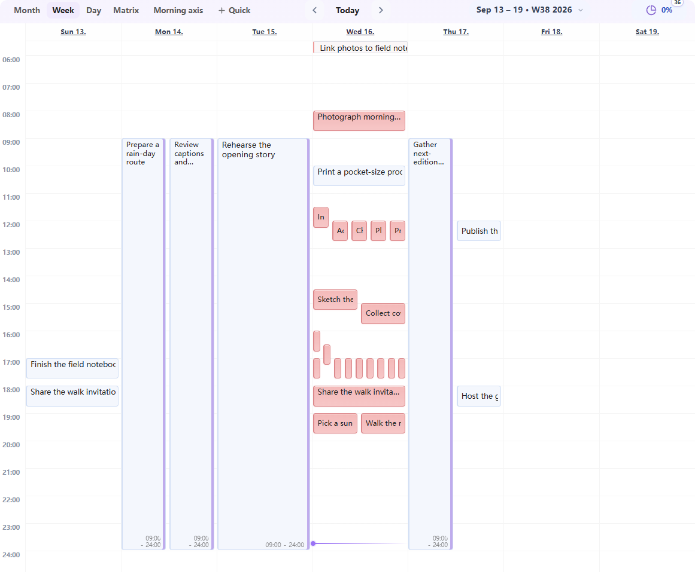
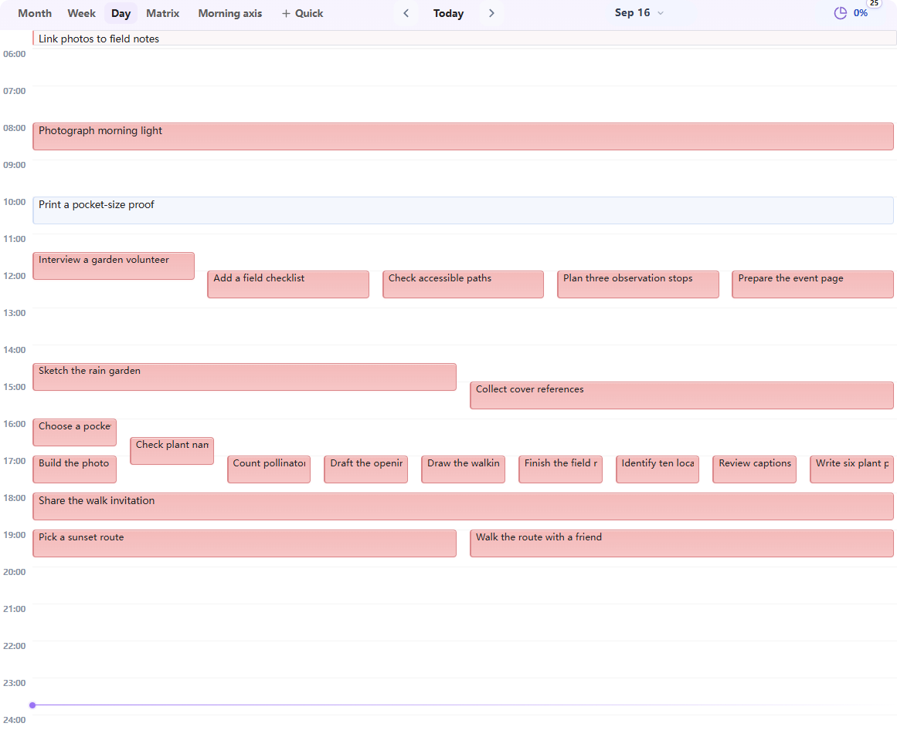
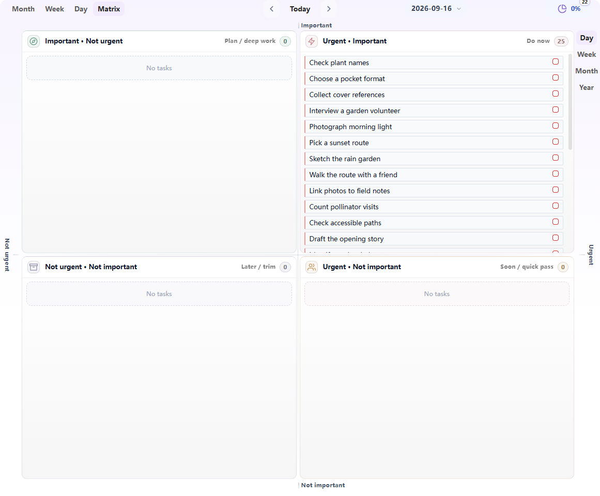
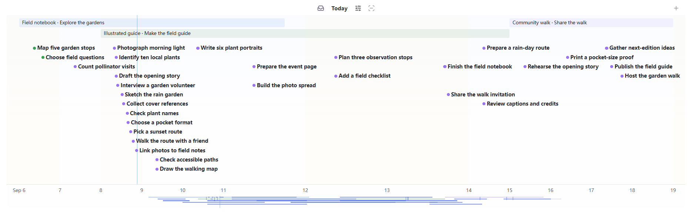
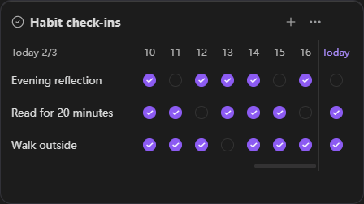
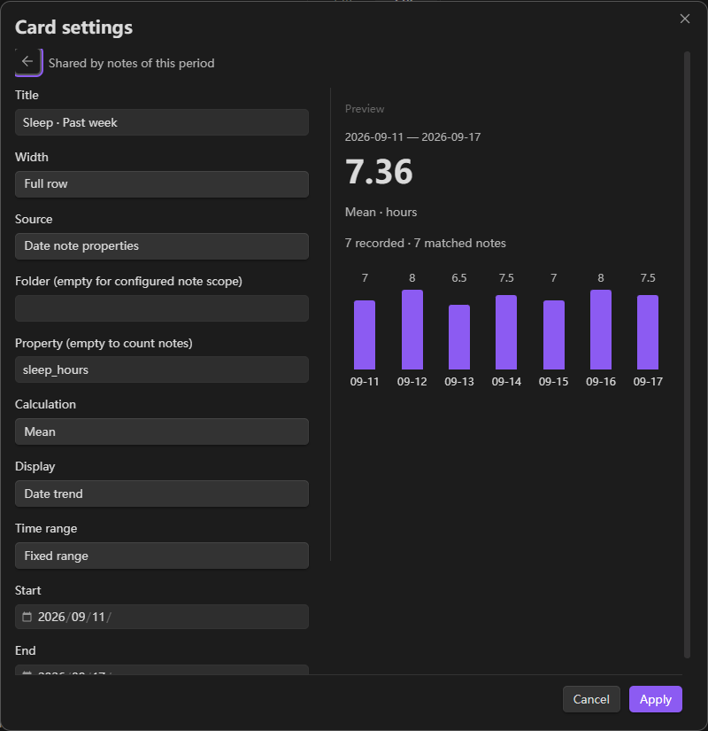
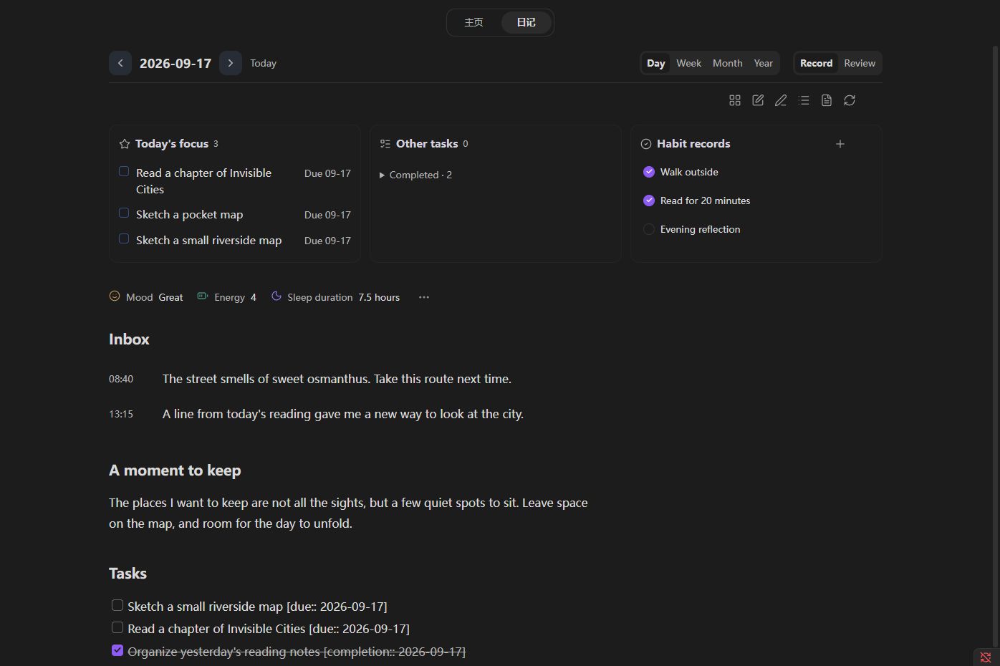
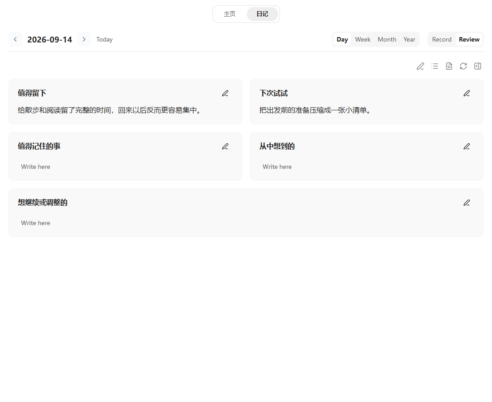

# Noria for Obsidian

**Language**: English | [简体中文](README.zh-CN.md)


<p align="center">
  
</p>

**Turn knowledge into action, and action into lasting knowledge.**

Noria connects daily records, notes, and knowledge management with planning, execution, and review. Its configurable Home brings together Task Board, Task Timeline, Calendar, projects, Inbox and MOCs, habits, trends, and Review Center, helping you see the current state, choose the next useful action, and let long-term knowledge support ongoing work.



---

## Design Direction

| Principle | What it means in Noria |
| --- | --- |
| Visibility | Home statistics, heatmaps, task trends, note distribution, and daily-state signals make real work visible. |
| Low-friction planning | Task Board and Task Timeline help move from capture to arrangement without moving work into a separate app. |
| Configurability | Home is a widget dashboard; paths, scan scopes, modules, templates, filters, and appearance can be adapted to your vault. |
| Reusable data | The same Data API powers Home, tasks, timelines, periodic stats, review evidence, exports, and custom views. |

---

## Core Surfaces

### Home Dashboard

Home is Noria's overview surface. It brings "what needs attention today," "what has been accumulating recently," and "which entrances are worth revisiting" into one configurable dashboard: tasks, projects, Inbox, MOC links, habits, countdowns, weather, note trends, task completion trends, note distribution, heatmaps, and daily-state signals form a lightweight status board.

The statistics make workload visible. You can see recent note growth, task completion, habit continuity, daily-state changes, and vault distribution together. Inbox helps manage temporary capture; projects bring you back to active themes; habits support today's check-in and an adjustable history, initially 21 days; countdowns keep important dates inside daily awareness.

Home is also a widget dashboard. Built-in widgets can be enabled, disabled, reordered, and resized. You can add content widgets and, after explicitly granting trust under Maintenance, custom JavaScript view widgets from your vault. The default layout is only a starting point.

Each card’s **…** separates content management from width, move, collapse, duplicate and hide controls. Add, configure and restore cards directly in Home or Diary; each diary period has its own shared layout. Note, Base and Dataview cards reuse native rendering and Obsidian’s plugin installer.

Projects, Diary, Task Board, and Timeline share one task editor: check a task to complete it, or click its title to edit the task, dates, status, and tags. Expand repeat rules and dependencies when needed. **Add next step** writes to the project's existing task note, and the editor retains a source-note shortcut.

Home cards share header icons, add controls, and an **…** menu. Cards in the same row align in height; resize a card from its bottom edge, or restore **Automatic height** from its menu.

MOC entries form an aligned grid with small color markers and a separate icon for a same-name Canvas. Add an existing note with **+**, or manage order and colors through **…**. Project, MOC, workflow, and Base links use a separate tab and reuse an open source, retaining Home and unfinished project input.


Markdown widgets can display daily briefings, current suggestions, weekly reviews, or project-monitor notes produced elsewhere. Noria reads and links the configured `.md` files; it does not require a model connection or generate those documents itself.

### Task Board

Task Board turns tasks scattered across diaries, projects, and other notes into views you can plan from. Month view is useful for cycles and multi-day work, week view for near-term planning, day view for today's work, and matrix view for priority decisions.

Tasks remain in their original notes. New tasks can be written back to the matching diary, weekly note, or monthly note, while edits, drag actions, and completion changes stay in sync with Home statistics and the timeline.

In a busy month, scroll a week's task area to reach every task while its date headings stay visible. Multi-day bars scroll together and remain inside that week. Short timed blocks keep the title readable; open or hover a task for full details.









### Task Timeline

Task Timeline brings dated tasks and project phases into one view. Use the main area for a broader plan or keep the sidebar open for the current schedule. Zoom from days into hours to see how a day unfolds.

Every task uses a circle followed by a short title. Circle color shows completion while titles stay readable; hover or focus a task to see its full schedule, duration, and source note. Drag the bottom date row or minimap to move through time.

Name project or global time annotations to mark phases above the tasks. These periods can be edited without changing task dates, and tasks remain connected to their original Markdown notes.



*Timeline screenshots use example tasks and show the interactions in Noria 0.4.6.* [Timeline guide](docs/USER-GUIDE.md#4-task-timeline)

### Calendar

The sidebar Calendar locates period notes using Noria-managed paths, Obsidian Daily Notes, or a custom folder and naming pattern. In the local experience build, day, week, month, and year entries open Diary; missing notes are created on the first save. Quarterly notes and native entry points with Home disabled retain their existing creation settings.

### Habits

Habits separate "did I do this today" from "is this becoming established." The Home Habit card supports direct check-ins and shows 21 days by default. **… → Card settings → History days** offers 7, 14, 21, 30, 60, or 90 days; narrow cards scroll history with names fixed and today visible. Records stay in date Markdown, with heatmaps and aggregate trends available separately.



### Trends And Statistics

Trends help you observe change across a period instead of judging each day. Note growth, task completion, habit and workload heatmaps, vault distribution, and daily-state signals share one time range and can be arranged as independent Home widgets.

Define daily record names, types, options and units, then add a trend or distribution from the same property. Statistics also accept any note folder and property, with source drilldown. Countdowns support actual start / end dates, drag rescheduling and archives in the original note. These card and record improvements are in the current experience build.



### Diary And Review

Persistent **Home / Diary** navigation keeps the workbench easy to return to. Inside Diary, **Record / Review** switches the reading and writing surface while keeping the same period and Markdown source. Other Home cards stay in place.

Select the date to open the existing calendar on demand, or keep it in the sidebar. Diary brings together period tasks, earlier unfinished work, daily habit records, and date-note prose. The top-three focus appears only in the actual current day, week, month, or year. Longer periods provide a compact summary and on-demand statistics. Missing dates preview the configured template; typing autosaves to the date note without leaving the editor. Browsing alone creates no file, and the source icon can explicitly create and open one.

Focus, tasks, and habits use Home-style cards. The card's **…** menu adjusts width, order, or collapse; the current workbench remembers the layout across dates and reopening.



Quick notes keep thoughts, links, and line breaks in the selected day's Inbox. Home and the **Noria: Quick note** command capture to today. Record mood and energy beside the diary; select a date in Daily State to return to its notes.


*Example content in the local experience build.* [Diary guide](docs/USER-GUIDE.md#5-calendar-and-diary)

Review Center gives daily, weekly, monthly, and yearly reviews the same reading and writing experience. Saved reviews open as readable sections drawn from your Markdown; an unwritten period opens ready to write. Edit one section or the full review, with changes autosaved to the corresponding date note. Open records, earlier reviews, or external analysis as references when useful; analysis joins your review only when you choose to add it. Diary and Review use Obsidian's reading/editing command and your assigned shortcut. An optional outline can help you start; there are no required GDD fields.

External review prompts start with a compact material file containing original records and relevant evidence. They favor concrete themes and grounded reflection, with source checks only for important gaps; there is no required word count or fixed GDD structure.

Select a passage in a record or review, then use the context menu or **…** to create a task or link an existing one. New tasks go to a project or daily tasks, with dates left optional. The passage stays intact, and the task keeps a link back to it. [Task adoption guide](docs/USER-GUIDE.md#86-create-or-link-tasks-from-records)



*Example review in the upcoming review update; included in the local experience build.* [Review guide](docs/USER-GUIDE.md#8-review-center)

The same data layer powers Home statistics, task views, timeline summaries, periodic views, review evidence, and exports. This avoids each workflow scanning the vault in its own way and makes Noria data easier to use from external agents, scripts, and synchronization workflows.

### Configure It Around Your Vault

Noria can run in a new portable `Noria/` workspace or connect to an existing vault through paths and scan scopes. Settings cover paths, Home widgets, task filtering, Calendar sources and period templates, appearance, weather, review prompts, and diagnostics. The goal is to fit your knowledge system rather than force your vault into a fixed directory layout.

---

## Workflow

Noria is designed around a simple knowledge-work loop:

1. **Capture** in Inbox, diary notes, or project notes.
2. **Organize** through Home, project panels, MOC links, and Inbox actions.
3. **Plan** with Task Board and Task Timeline.
4. **Execute** from the day view, side timeline, and source tasks.
5. **Review** with reusable evidence and write the final reflection back into your diary.

---

## Quick Start

1. Install and enable **Noria** from `Settings -> Community plugins`.
2. Open `Settings -> Noria -> Overview` and choose **Standard workspace** for a new vault or **Custom paths** for an existing vault.
3. Review the initialization preview, then create only the missing starter files you want. The examples are ordinary Markdown and can be edited or removed at any time.
4. Open **Home** and follow one sample task from the dashboard to its source note, then inspect the same task in **Task Board** or **Task Timeline**.
5. Adjust diary paths, templates, modules, and Home widgets only when you need a different structure.

Noria can create diary notes from its task and review flows, and it also works with Obsidian's core Templates plugin or calendar-style plugins that create dated notes from templates. Use whichever diary creation flow fits your vault best; Noria only needs the diary root and template paths to be configured correctly.

---

## Roadmap

- **Workbench experience**: continue refining module interfaces, responsiveness, interaction logic, and narrow-pane behavior so common workflows stay direct.
- **Composable Home**: improve card creation, visibility, ordering, and sizing, and explore long-term content entrances such as bookshelves, media shelves, and game shelves.
- **Feeds and briefings**: let RSS and other external workflows write daily feeds, summaries, and project monitoring into agreed Markdown files for Home to present.
- **External agent collaboration**: help external agents organize plans, projects, habits, and periodic reviews within clear data and write-back boundaries.

---

## Installation

For normal use, install the release assets. Do not clone the source repository into `.obsidian/plugins/noria/`.

1. Download the latest release assets from [GitHub Releases](https://github.com/jellyns/obsidian-noria/releases/latest):
   - `manifest.json`
   - `main.js`
   - `styles.css`
2. Create the plugin directory in your vault:

   ```text
   .obsidian/plugins/noria/
   ```

3. Put the three files into that directory.
4. Restart Obsidian, or reload community plugins.
5. Enable **Noria** in `Settings -> Community plugins`.

After Obsidian saves settings, the plugin folder normally contains:

```text
.obsidian/plugins/noria/
  manifest.json
  main.js
  styles.css
  data.json
```

It should not contain `src/`, `tests/`, `scripts/`, `node_modules/`, or the full Git repository.

---

## Documentation

- [User Guide](docs/USER-GUIDE.md): installation, every module, Settings, common workflows, troubleshooting, paths, and developer reference.
- [GitHub Issues](https://github.com/jellyns/obsidian-noria/issues): bug reports and feature requests.
- [Community](docs/COMMUNITY.md): help, workflow sharing, and community channels.
- [Support development](docs/SUPPORT.md): voluntary support for Noria's maintenance.
- [Changelog](CHANGELOG.md): release history.
- [Contributing](CONTRIBUTING.md): local development, validation, and PR expectations.
- [Security](SECURITY.md): how to report security issues.

---

## Privacy and disclosures

- Noria requires no account and contains no telemetry, analytics, ads, or payments.
- Noria does not call an AI service. Review Center prepares local evidence and prompts that you may copy to a tool you choose.
- Weather is off in a fresh installation. The first explicit workspace initialization enables it; later repairs preserve the user's choice. When weather loads, Noria may contact IP-location and weather services such as `ipwho.is`, `ipapi.co`, Open-Meteo, or `wttr.in`; QWeather is contacted only when you configure its host and API key.
- Review Center keeps its Git evidence field compatible with external evidence providers, but Noria does not execute Git or other shell commands.
- Custom JavaScript view widgets are disabled by default. If you explicitly enable them under Maintenance, they execute a configured vault-relative JavaScript file with Noria and Obsidian plugin access. Noria blocks protocols, absolute paths, and path traversal; only enable this for files you trust. Built-in Noria views do not require this permission.
- Settings stay in the plugin `data.json`; supported secrets are stored through Obsidian SecretStorage. Snapshot and review exports remain inside the vault unless you choose another vault path.

---

## Development

Clone this repository only when you want to develop Noria itself.

```bash
npm install
npm run check
```

To install the current build into a separate test vault while keeping the plugin directory clean:

```bash
npm run install:vault -- "/path/to/test-vault"
```

Replace the example path with a separate test vault. The command builds the plugin and copies only `manifest.json`, `main.js`, and `styles.css` into that vault's `.obsidian/plugins/noria/` directory. Existing Noria `data.json` is preserved.

---

## Project Layout

- `src/main.js`: Obsidian plugin entry and settings implementation.
- `src/runtime/`: Home, Task Board, Timeline, Review Center, and shared runtime sources embedded into `main.js` during build.
- `src/generated/embedded-runtime-sources.js`: generated embedded resource index. Do not edit it manually.
- `scripts/`: build, release check, and test-vault install scripts.
- `tests/`: Node tests for runtime behavior, settings, packaging, and release checks.
- `manifest.json`, `main.js`, `styles.css`: release assets installed into Obsidian.

---

## Data Storage

- Noria settings are stored in Obsidian's plugin `data.json`.
- Optional weather credentials use Obsidian SecretStorage.
- Review evidence and snapshot exports are written under the plugin cache unless you choose another output path.

---

## License

MIT. See [LICENSE](LICENSE).

---

## Community

Ask questions, share workflows, and suggest improvements. English and Chinese are welcome.

[Join Noria on Discord](https://discord.gg/JjCyDvFvgY) · [Obsidian Forum](https://forum.obsidian.md/t/noria-connecting-notes-projects-tasks-and-reviews-in-obsidian/118107) · [GitHub Issues](https://github.com/jellyns/obsidian-noria/issues)

Scan to join the Noria Discord community:

<a href="https://discord.gg/JjCyDvFvgY"></a>

[Community guide](docs/COMMUNITY.md)

## Support development

If Noria helps you, voluntary support is welcome and helps sustain development and maintenance. All features remain available to everyone.

Scan with **Alipay** to support Noria:

<a href="https://raw.githubusercontent.com/jellyns/obsidian-noria/main/docs/assets/support/alipay.jpg"></a>

[About supporting Noria](docs/SUPPORT.md)
