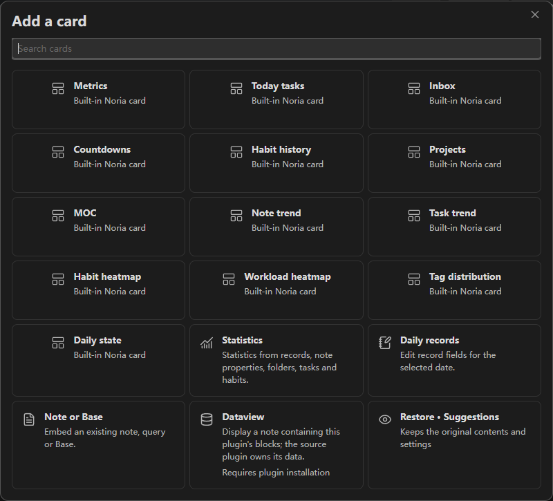
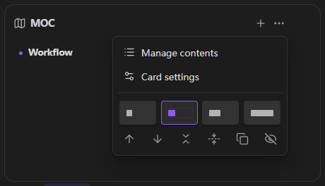
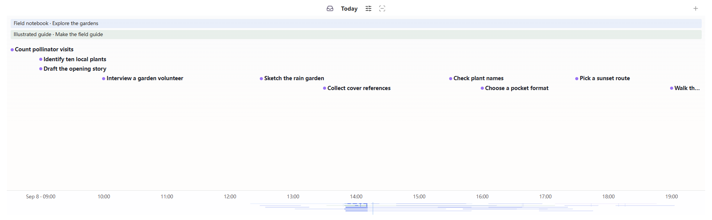
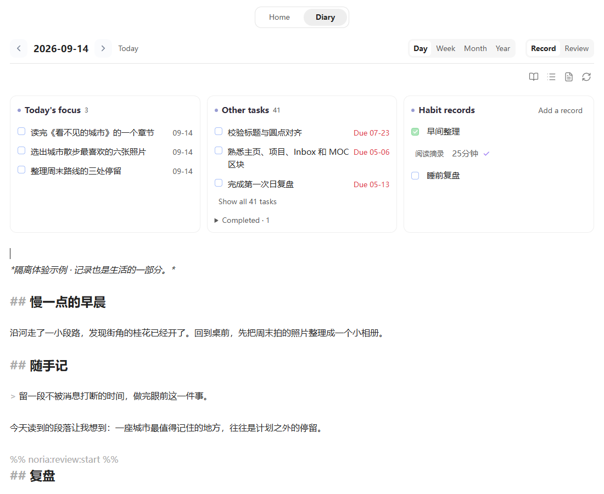
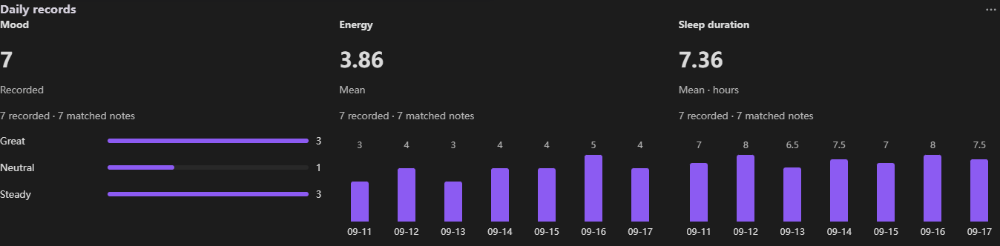
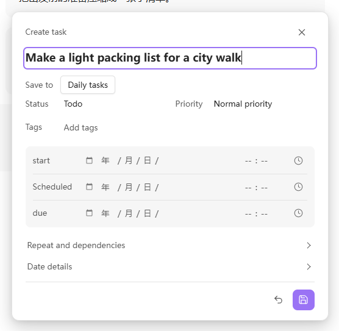
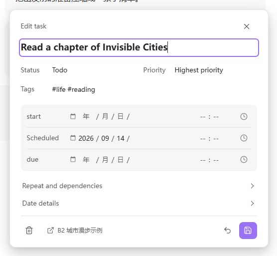

# Noria User Guide

**Language**: English | [简体中文](zh-CN/USER-GUIDE.md)

Noria connects daily records, accumulated knowledge, planning, execution, and review in one Obsidian workbench. It uses ordinary Markdown as its content foundation and provides a configurable Home, Task Board, Task Timeline, Calendar, Habits, Trends and Statistics, and Review Center so you can see the current state, choose the next useful action, and keep long-term knowledge connected to ongoing work.

This guide starts with installation, then covers every module, common workflows, troubleshooting, paths, and advanced extension boundaries. For the product overview and release information, see the [README](../README.md).

## 1. Installation And Initialization

### 1.1 Requirements

Noria is currently a desktop plugin and requires Obsidian `1.5.0` or newer.

When Noria is available through Community plugins, search for **Noria** and enable it. For manual installation, place only the three GitHub Release files in:

```text
.obsidian/plugins/noria/
|-- manifest.json
|-- main.js
`-- styles.css
```

Obsidian creates `data.json` after settings are saved. Do not copy `src/`, `tests/`, `scripts/`, or `node_modules/` from the source repository into a user plugin directory.

The Noria interface follows the Obsidian language. Unsupported languages fall back to English.

### 1.2 Choose A Workspace Mode

The first time you open `Settings -> Noria -> Overview`, choose one mode:

- **Standard workspace**: for a new vault, a test vault, or a vault that keeps Noria-managed content under `Noria/`.
- **Custom paths**: for a vault that already has Inbox, Projects, Diary, MOC, and template structures.

IPARA is not a third profile. For an IPARA vault, choose Custom paths, keep Noria lists and workflow files under `02_Areas/Noria/`, and map content roots to the existing top-level buckets.

### 1.3 Initialization Flow

Noria does not silently create or move files at startup. Use this order:

1. Review the workspace preview and missing items.
2. Check Inbox, Projects, Diary, template, and registry paths.
3. Confirm which files and parent directories will be created.
4. Run initialization or repair.
5. Open Home and add a next step to Noria Workspace, or create a project through the Project card’s **+**.
6. Complete it or open its details, then find the same task in its source, Diary and Task Board.

Initialization supplies the workspace files and entrances without synthetic completions, check-ins or deadlines. Screenshots use a separate demonstration vault.

### 1.4 First Acceptance Check

- Home opens, and an unspecified avatar uses the Noria mark.
- All four Task Board views can be selected.
- Task Timeline loads without opening Task Board first.
- Calendar creates period notes under the configured path.
- Habit, countdown, project, and MOC entries open their source files.
- Review is available from the workbench navigation and supports Day, Week, Month, and Year.
- Weather is off in a fresh installation. The first explicit workspace initialization enables it; later repairs preserve the user's choice. Configure a location or provider only when weather is needed.

## 2. Home

Home is Noria's central workbench, not a fixed collection of features. It organizes current state, next actions, knowledge entrances, and longer-term observations on one configurable page.


### 2.1 First-Screen Structure

The default first screen is organized as:

1. Identity, quote, weather, and overview metrics.
2. Capture, task input, and current progress.
3. Today Tasks, Inbox, and Countdown cards.
4. Projects and MOC entrances.
5. Trends and Statistics, followed by Review Center.

The default order is only a starting point. Every major card can be managed as a level-one widget.

### 2.2 Capture And Task Input

Home provides two input modes:

- **Capture** writes an idea, clue, or temporary record to today's diary Inbox.
- **Task** writes an actionable item to today's diary task section.

Input, mode selection, submission, and adjacent navigation stay on one line. Captured material does not need to be classified immediately.

### 2.3 Today Tasks

Today Tasks group work by pace and current capability instead of keeping deadline pressure permanently visible.

- Incomplete tasks use clearer weight.
- Completed tasks stay readable without an aggressive strike-through treatment.
- A suggested first task is naturally sorted to the top with a quiet marker instead of a separate recommendation panel.
- Clicking a task opens its source; hovering shows dates, tags, project, and source details.
- Day, Week, Month, and Year ranges remain available.

An unfinished task can continue the next day. Noria does not treat rollover as punishment.

### 2.4 Inbox

The Inbox card shows the current queue, workflow groups, and a small set of actionable items. Its header keeps view switching, queue opening, and add actions. The guide area does not duplicate a second Inbox card.

Today's check-ins and history stay in the Habit card. It shows the last 21 days by default; **… → Card settings → History days** offers 7, 14, 21, 30, 60, or 90 days. Narrow cards scroll horizontally, keep names fixed, and start at today. Click a date cell to backfill a check-in, or a habit name to edit its parameters.


### 2.5 Countdowns

Each item shows “In n days”, or “Today”; Home shows upcoming items only; expired and archived items remain available in the manager. Use **+** to add an item and select an item to edit its name, start and end dates. Progress uses the actual date range; an older item without a start date has no invented progress.

Hover or focus the end of the progress bar to adjust the deadline: drag right for earlier, left for later. Preview the proposed date, release to save, or press Escape to cancel. Arrow keys adjust one day; Shift adjusts a week. Archive and restore items in the manager. Records stay in countdown Markdown; task-backed items update the original task.

### 2.6 Projects And MOCs

- Click a project to select its tasks. The note icon beside **Add next step** opens its main note while retaining the selected project and unfinished input.
- MOC entries use an aligned grid that adapts to the card width. A small color marker identifies each entry; a same-name Canvas gets a separate icon. The display omits the trailing `·MOC`, while the source filename stays intact.
- Use **+** to choose an existing Markdown or Canvas file. Use **… → Manage content** to adjust order, color, or paths and remove entries. Removing an entry keeps the source file. File and folder renames in the vault update saved entry paths; a missing entry offers a replacement picker.

Project, MOC, workflow, and queue source links keep Home available and reuse an existing Markdown, Canvas, or Base tab. Ctrl/Cmd-click or middle-click opens another tab; Ctrl/Cmd+Alt-click opens a split. Hover preview follows Obsidian's Page preview settings. Home keeps links to source documents rather than duplicating their content.


Project management lists names and stages before opening a single item for editing. Choose an existing note or explicitly create a project note. An invalid existing path does not silently create a file. Hiding, completing or removing an entry keeps its source note.

### 2.7 Home Widgets

Use **+** on the Home action bar or Diary toolbar to add built-in functions, a note / Base, statistics or an available third-party component. Configure the card with a preview of real content; restore hidden cards from the same catalog.

Each card’s **…** separates content management from layout: visual width choices, move, collapse, automatic height, duplicate and hide. Copies have independent configuration. Cards in a row share a height; the bottom handle adjusts it, while a narrow single column grows naturally. Home has its own layout. Daily, weekly, monthly and yearly diaries each share a separate layout across dates.

A Dataview card uses a note containing a query. Its dependency opens in Obsidian’s native plugin installer. Two cards can use separate notes; disabling the dependency affects those cards, and enabling it restores them. Note / Base cards reuse native rendering. Other plugins need an adapter or embeddable note content; arbitrary full plugin interfaces are not supported. See the [card provider API](CARD-PROVIDERS.md).





### 2.8 External Markdown Workbench

Markdown widgets can read daily briefings, current suggestions, weekly reviews, and project-monitor files produced by external agents, RSS workflows, or other scripts. Noria displays the content, source handoff, and freshness state; the external workflow remains responsible for generating it.

## 3. Task Board

Task Board organizes Markdown tasks from diary, project, and regular notes into four complementary views. Tasks remain in their source files.

### 3.1 Month

Use Month to review task distribution, multi-day work, deadlines, and workload over a longer span. Start with the overall shape, then move into Week or Day to arrange time.

Scroll within a crowded week to reach its remaining tasks. All seven days scroll together under fixed date headings, preserving continuous multi-day bars; other weeks stay in place. Editing or completing a task preserves your position. Completion uses the checkbox and color cues while titles stay readable.


### 3.2 Week

Use Week to arrange tasks and time blocks across the current week. Parallel tasks adapt title and time detail to the available width and height while preserving task identity.


### 3.3 Day

Use Day for concrete daily arrangement. Untimed and all-day tasks stay at the top; tasks with a time range enter the hourly grid.


### 3.4 Matrix

Use Matrix to reconsider importance and urgency when the task pool grows. The four areas reorganize one task pool; they do not duplicate tasks.


### 3.5 Edit Tasks

The task editor supports:

- title and tags;
- priority and status;
- `start`, `scheduled`, `due`, `completion`, and related dates;
- start and end time;
- recurrence and before/after dependencies;
- source opening, saving, and deletion.

In any Markdown note, place the cursor on a task or plain text line and run **Noria: Edit or create task at cursor**.

Home, Diary, Task Board, and Timeline use this same editor. Start, Scheduled, and Due stay in fixed rows, with space for individual date and time digits. Type a time directly, or open the picker using the clock or `Alt+↓`. Expand repeat rules, dependencies, and lifecycle dates when needed. Dates and times are optional; changing the title adds no date, and editing one endpoint does not move the other. Save applies changes. Closing retains input for the current session; **Discard changes** clears it.

### 3.6 Create Period Notes

Selecting a date opens Diary in the workbench. A missing note is created on the first save, using the configured path and template. Quarterly notes and native-note entry points when Home is disabled still follow Calendar's creation-confirmation setting.

## 4. Task Timeline

Task Timeline is Noria's own time view for observing tasks across dates, time blocks, and stages. Tasks still come from source Markdown; the view provides organization, filtering, and interaction.


*This section describes Timeline in Noria 0.4.6. Screenshots use example tasks.*

### 4.1 Main Area And Sidebar

- The main editor area is useful for longer ranges, layer filtering, and broader inspection.
- The sidebar is designed to stay open as a compact view of the current schedule. Titles adapt to available vertical space.

Task Timeline should load after Obsidian restores the workspace and should not require Task Board to be opened first.

### 4.2 Navigation And Scale

- Click **Today** to return to the current date.
- Use the wheel to pan horizontally through time.
- Drag an empty part of the time band to pan.
- Use `Ctrl/Cmd + wheel` to zoom.
- Drag either the bottom date row or the minimap to pan. Focus this area and use the arrow keys to pan or `+` / `-` to zoom.

Dates and the minimap share one continuous bottom area. There is one date row; at an hourly scale, the date appears on the first tick and when the day changes. Brighter minimap segments indicate the visible range.



### 4.3 Task Visuals And Write-Back

Task rows remain mixed across projects. The circle and short title identify the task; extra details appear during interaction:

- every task uses the same circle followed by its short title, positioned at its start time; tasks that started before the visible range stay at the left edge;
- hover or focus reveals full times, the duration rail, and source details; interval handles appear only during interaction;
- circle color expresses completion; completed titles keep the same color and weight as incomplete titles;
- full titles are shown when space allows and truncated only when necessary;
- clicking a title or circle opens the task in its Markdown source;
- dragging a task or interval boundary writes back to the source task line.

Before writing, Noria checks the source fingerprint and rejects an overwrite when the source has changed.

### 4.4 Layers And Filters

Available layers include tasks, marks, notes, Git, Noria, and Pomodoro. Pomodoro is off by default.

Filters support:

- showing or hiding completed tasks;
- text queries;
- including only specified tags;
- excluding specified tags.

Filters change only the view and do not modify tasks.

### 4.5 Named Views

A frequently used timeline state can be saved with a custom name. It includes:

```text
name, time center, scale, layers, completion state, query,
include tags, exclude tags, mark mode
```

When the current state differs from a saved view, Noria marks it as modified. Only an explicit update overwrites the saved view.

### 4.6 Time Annotations

1. Click the toolbar button **Select a time range annotation**, then drag across an empty part of the main area to preview a range. You can also use `Shift + drag`.
2. Enter a name, choose a project registered on Home or **Global period**, and adjust the times and color.
3. Select **Save** to keep the annotation. **Cancel** or **Escape** discards the draft. Either action returns to normal panning.

Annotations appear as compact phase bands above the mixed task rows. Project annotations show **Project · Phase**. Overlapping bands use up to two rows; open **More phases** to access additional annotations. Click a band name to edit or delete it. While editing, dragging an endpoint changes the draft; use **Save** to keep it or **Escape** to cancel. Annotations do not change task dates. They describe phases or periods; they are not tasks or measured work time.

## 5. Calendar And Diary

Persistent **Home / Diary** navigation contains a **Record / Review** switch inside Diary. Both modes share the selected period, date, and Markdown source. This update is available in the local experience build.


Select the date title to open the existing calendar temporarily. **Open in sidebar** keeps it available beside the workbench; when that calendar is already visible, the date title uses it. Task Board, Timeline, and ordinary notes retain their independent views.

### 5.1 Main Actions

- Hover or focus a card to reveal **…**. Choose Narrow, Standard, Wide, or Full row; move or collapse the card, or reset the diary card layout. Widths adapt to narrow panes. Layout belongs to the current workbench and is restored across dates and reopening without changing note contents.
- Day, Week, Month, and Year change the period around the selected date. A day cell keeps the active period and Record / Review mode; a week number explicitly selects a week.
- Select month/year headings to browse. Use the arrows to reach other years, then choose a date. Browsing alone does not change the writing target. Use Diary's Month or Year switch to open that period.
- **Today / This week / This month / This year** returns to the actual current period. Choosing a date closes the temporary calendar and returns keyboard focus.
- The date arrows use the same controls as the task panel. The pencil/book icon switches between editing and reading, as does Obsidian's reading/editing command with your current shortcut. The list, file, and refresh icons open the outline, source note, and reload action. Hover or focus a control for its label.
- Existing notes open for reading. Missing dates show the configured template ready to edit. Changes autosave while you write; saving keeps the editor, selection, and scroll position. `Ctrl/Cmd+S` saves immediately.
- Switching pages retains drafts, the cursor, and scrolling. Closing and reopening can recover unfinished text and its target date.



*Editing in the local experience build, with example note content. The book icon returns to reading; no separate Save button is needed for normal writing.*

### 5.2 Creation Behavior

Browsing, focusing, or leaving an untouched template creates no file. The first text change is autosaved to the selected date; a habit check-in or quick capture can also create it using the same configured template. The source icon explicitly creates and opens a missing note using Calendar's creation settings. Switching dates or reading modes flushes pending edits to their original destination. An existing empty or frontmatter-only note stays as it is; Noria does not refill its template.

New built-in day, week, month, and year templates start with **Notes** and **Plan**. Inbox, habit records, and review are added when used. Existing custom templates remain unchanged, and date variables follow the selected period, including past dates. Rename, remove, or reorder headings freely. `cssclasses: [daily-clean]` scopes typography to date notes and inherits the theme and fonts. The action list reads tasks across their original sources, including earlier unfinished work; task titles open the shared compact editor, its source icon opens the original line, and checkboxes complete or reopen the original task. The top-three focus appears only for the actual current period. Checkboxes inside the prose preview remain read-only.

Diary and Home habit actions write dated records to the configured daily note. Definitions stay in Habits.md; actual values and targets are stored with each quantitative record. Past dates show recorded activity and offer explicit backfill; future dates cannot be checked in. Recording a habit can create a missing daily note. Week, month, and year show a compact task/habit/writing summary with full statistics on demand.

You can check a task or record a habit while editing prose. Independent changes carry into the draft; overlapping edits still require comparison. Habit annotations, tags, and block links are preserved. Outline follows the current headings in both reading and editing.

If saving fails or the source changes externally, the editor keeps your input and offers retry, copy, and recovery actions. Reopened recovery text waits for editing or **Use this draft** before saving; simply opening it does not overwrite the source. Review uses the same protection described in [Save protection](#85-save-protection).

Installation does not rewrite existing templates, embedded views, or historical notes. The older `focusPanel` and `habitCheckin` habit controls also write to the selected date note, supporting withdrawals and actual values; they require an explicit date. Existing registry check-ins remain readable, and date-note records take precedence for the same habit and day, including withdrawals. Review historical migration differences first; duplicate records remain available for comparison. Quarterly notes and native entry points with Home disabled retain Calendar's creation and confirmation behavior.

The date-note preset uses matching heading levels in reading and Live Preview. Its styles are maintained in the plugin. If your vault also enables the older `daily-clean` CSS snippet, disable that snippet in Appearance to use the plugin preset; you can keep the snippet file.

### 5.3 Date Sources

Calendar supports three sources:

- **Noria** uses Diary root and templates from `Overview -> Paths`.
- **Daily Notes** reads Obsidian Daily Notes settings.
- **Custom** uses a separately configured folder, naming pattern, and template.

Only fields relevant to the active source are shown, preventing multiple path systems from competing on the same page.

### 5.4 Quick Notes And Daily State

In a daily **Record** page, the square-pencil icon opens Quick note for the selected date. Home capture and the **Noria: Quick note** command use today; assign a shortcut through Obsidian if useful. The composer names its target date. Week, Month, and Year do not silently write a daily note.

Enter inserts a new line; `Ctrl/Cmd+Enter` saves. Links, paragraphs, and indentation stay in Markdown under `## Inbox`. Today's notes receive a time; past or future dates do not receive a made-up event time. You can supply `[HH:mm]` explicitly. Reading shows a quiet time column, with untimed notes after timed ones, without rearranging the source.

A first capture uses the selected date's configured template. Unfinished input survives changing dates; a failed save keeps the text for retry. Independent prose changes are preserved, while an unresolved conflict blocks capture. Recording a note does not create a task; use passage selection when you choose to turn it into one.

Mood and Energy beside the daily record use native menus. Clear removes a value; Focus is optional under **…**, and existing weather remains background information. Filling in a state on an empty date also uses that date's template.


*Example content in the experience build.*

## 6. Habits

Habits separate today's completion from long-term formation.

### 6.1 Today's Habits

The compact habit entry under the Home Inbox card is for quick check-in and does not repeat historical charts.

### 6.2 Habit Cards

The full habit card shows habit names, date columns, and check-in states. Consecutive completed days form connected bands; gaps and partial records remain distinct. Habit names reuse MOC card title size and weight so typography stays consistent across Noria.

Supported behavior includes:

- checkbox habits;
- numeric habits;
- targets and units;
- adding, editing, pausing, and marking a habit as established;
- refreshing sleep habits from `#tl/sleep`.

### 6.3 History And Heatmaps

Home keeps names and today’s controls fixed, with horizontally scrollable history between them. The range includes today exactly once. It starts at 21 days; **… → Card settings → History days** offers 7, 14, 21, 30, 60 and 90. Select a historical cell to backfill that date.

Home and Diary share checkbox, numeric and time controls. Actual values stay separate from goals; failed saves retain input. The registry owns definitions and each date note owns its records. Renaming retains history, pause / established states keep past records, and a new goal does not reinterpret old check-ins.

Numeric habits can explicitly bind to a daily record property, sharing one value with statistics. Heatmaps and period summaries remain available separately.

## 7. Trends And Statistics

Trends and Statistics are for observing sustained change, not evaluating yourself every day.

### 7.1 Shared Range

All statistics cards share one range control:

- Recent 30 days;
- Week;
- Month;
- Year;
- Custom range.

### 7.2 Note Trend

Note Trend shows the number of newly created notes and the current word count of diary files. Word count describes current file content and is not the same as words added on that day.

### 7.3 Task Completion Trend

This chart shows total task activity, completed tasks, and completion rate. Completed tasks without a completion date stay in an undated group instead of being forced into a day.

### 7.4 Habit And Workload Heatmaps

- Habit heatmaps can show one selected habit or the aggregate.
- Workload heatmaps normalize note, task, and word-count activity into relative intensity. They are not exact time tracking.

### 7.5 Note Distribution

Note Distribution groups notes by top-level vault directory, not by tags. It helps reveal long-term content distribution and is not a score for how many folders you have.

### 7.6 Daily State

Mood and energy are optional presets that can be renamed or disabled. In Diary, **… → Record fields** lets you choose a preset, reuse a property or create a field. Configure options, a scale, a number / unit or a toggle, plus an icon and color. Replace a numeric value or add to its daily total; each field keeps one current value per day.

Diary uses compact, field-colored controls that save a selection immediately. Home’s Daily records card aligns up to three fields on one date axis: bands for categories and independently scaled trends for numbers. Missing dates remain gaps, not zeros. Hover or use the arrow keys to select a date; click or press Enter to open its diary. Choose displayed fields with the header filter icon, and expand Summary & sources for distributions, averages and source records.

Values live in the date note’s native properties. Disabling a field preserves history; renaming its display label keeps the property key. Use a separate field for a different unit or type so old values retain their meaning. Review material includes the configured names, units and values for the selected period.



### 7.7 Custom Statistics Cards

Choose “Add statistics card” from a record to prefill its property, or select Statistics in the card catalog to use any note folder and property. Set scope, property, calculation and display while previewing the matched notes and actual result. Additional filters cover subfolders, tags, property conditions and grouping.

Use count, sum, mean, minimum, maximum or category distribution, or reuse task and habit statistics. Diary cards follow the selected period; Home follows its shared range. A card can instead use fixed or all dates. Trends for ordinary notes require an event-date property or an explicit file creation / modification date. A current category is not a history of changes.

Missing values remain distinct from zero and false. Incompatible types or a specified mixed-unit property list the affected sources. Multi-select categories count each note once per category. Select a number, bar or date to inspect its sources, then open the original note in a separate tab.


*Screenshots use isolated demonstration records. Card and configurable-record improvements are in the current experience build and have not been formally released.*

## 8. Review Center

Open **Diary → Review** for Day, Week, Month, or Year. Switching between Record and Review keeps the date and uses the same Markdown note. Review commands still open the requested period directly. This update is available in the local experience build and has not yet been formally released.


*The screenshot uses example content.*

### 8.1 Core Flow

1. Select a period and target date.
2. Read an existing review, or start writing if the period is still unwritten.
3. Use a section's pencil to edit it, or **Edit review** for the full Markdown. Both edit the same draft.
4. Open **Reference** when you need records, earlier reviews, evidence, or external analysis.
5. Changes autosave to the selected date note while you keep editing. Reading a different reference does not change this destination.

### 8.2 Reading And Editing

Sections follow the actual Markdown hierarchy and order, including custom and repeated headings. Short sections are shown in full; long ones offer **Read more**. Wide panes can pair two adjacent short sections, while narrow panes use one column. The outline icon opens a section menu. Source, reload, and reference icons stay beside it; hover or focus them for their labels.

The editor uses Obsidian's Markdown Source mode, with headings, lists, links, undo/redo, and `Ctrl/Cmd+S` for immediate saving. Autosave keeps the editor and cursor in place, and waits for IME composition to finish. Editing a section keeps the rest of the document intact. **All sections** and the book icon flush pending edits before returning to reading; Obsidian's reading/editing command and your assigned shortcut also work here. Use undo for ordinary corrections. To rename the review's outer title, edit the full Markdown.

**Add a writing outline** is optional. You can rename, remove, or add headings, write a few unstructured lines, or keep GDD as a personal reflection outline. Noria no longer creates mandatory Highlight, Deviation, and Blocker fields. Existing templates and historical notes are not rewritten on installation; custom templates remain under your control. Mood, weather, energy, and focus remain separate Daily State data.

### 8.3 References Across Periods

**Reference → Records** opens alongside the review in a wide pane. In a narrow pane it temporarily takes the reading area; close it to return to the same editor and cursor.

A monthly review can reference weekly reviews and follow **Read source records** into their daily notes. A yearly review can reference months or daily records. Missing lower-level reviews do not prevent reading the available records or writing the current review. Dates resolve through Noria's existing diary and Calendar paths. When viewing the current day's records, the review being edited is omitted from the reference preview to avoid repeating it.

Tasks in review previews are read-only. Open the source to change them. Legacy embedded dashboards and note transclusions link to their source instead of exposing controls that could write using the wrong line number; ordinary images remain visible.

### 8.4 Evidence And External Agents

Noria prepares local evidence JSON and prompts but does not call a model inside the plugin. From **Reference → Analysis**, prepare the evidence, run your external workflow, then refresh to inspect its review note.

The prompt points to a `.material.json` file containing original prose, relevant task/state facts, and a source index. The full evidence JSON remains available for checking a specific gap. Monthly material prefers adopted weekly reviews; yearly material prefers monthly reviews, with daily records when lower reviews are missing. Executable view blocks and repeated statistics are omitted from the reading material; authored text is retained.

The default skill uses concrete theme headings, distinguishes facts from interpretation, and respects personal records without forcing them into action plans. Length follows the material. It asks for additional reading only when a named gap affects an important judgment; it does not require scanning the vault, all conversations, or every project's plans.

For an existing installation, use **Default review Skill → Install** in the review settings to update an unchanged older stock skill. Custom skills are preserved; **Reset** deliberately replaces them. Noria still does not run a model or automatically adopt its output.

**Add this section** adopts a selected analysis section into your review, preserves the existing text, and autosaves the result. Merely opening or refreshing analysis does not add it to your note. Adoption does not create tasks. Keep only material you want in your own review; observations and personal records need not become actions.

### 8.5 Save Protection

- Unsaved content enters a recovery draft.
- Noria blocks an overwrite when the target note changed externally.
- External analysis enters your review only through deliberate adoption.
- Your edits autosave; reopening a recovery draft alone does not write it to Markdown.

When a recovery draft's original source still matches, its text reopens for inspection. Edit it or choose **Use this draft** to resume saving. If the source changed, an older draft cannot be verified safely, or another draft remains for the same period, use **Drafts (n)** to inspect, copy, or use a selected draft. **Discard this draft** applies only to that draft.

After a save conflict, **Keep draft and reload source** preserves the local content before loading the latest source for editing. A successful save clears only the drafts handled by that save; other editors' drafts and unresolved content remain available. Hard breaks, indentation, and fenced code are preserved and included in conflict checks. Dates and periods that disagree are rejected.

The first save binds one complete review with two hidden-in-reading-mode comments. Keep both comments when editing the source; titles inside them are free to change:

```markdown
%% noria:review:start %%
## A few things from this month

### Worth remembering

Your own words.
%% noria:review:end %%
```

Incomplete or duplicate boundaries, ambiguous legacy review headings, and unfinished fences prevent saving. Use **Open source** to repair the note, then refresh. Content outside the review is preserved.

### 8.6 Create Or Link Tasks From Records

Select a passage while reading or editing a diary or review. Use the context menu or **… → Create task from selection**, or **Link selection to an existing task**. Both actions are also available as Noria commands, with shortcuts assignable in Obsidian.

For a new task, the shared editor lets you change the title and choose **Save to**: an existing project task note or daily tasks on the adoption day. Dates remain optional. Linking an existing task adds the source without changing its title, status, or schedule. Selecting text that is already a task opens that original task.

The original passage stays intact. The task stores an ordinary Markdown link and quotation beneath its checkbox. After saving, continue at the original reading or editing position; **View task** opens the task, and its **Back to record** icon returns to the source diary or review. Repeating the action on the same passage offers linked tasks and an explicit option to create another.

Closing the task editor keeps input for the current session; **Discard changes** clears it. Unresolved record drafts and changed source passages must be handled before a task can be saved. A task adoption action does not accept a recovery draft on your behalf.



## 9. Settings

Noria settings have seven top-level pages.

### 9.1 Overview

Overview initializes and checks the workspace:

- Standard workspace and Custom paths;
- missing files and directories;
- folded path groups;
- module switches;
- query range and performance;
- initialize, repair, and open actions.

### 9.2 Home

Home settings cover:

- display name, salutation, avatar, and quotes;
- level-one Home widgets;
- MOC entrances;
- Inbox workflow;
- review prompts;
- weather.

Home uses one widget manager instead of separate legacy managers for the first screen, workbench, and trends.

### 9.3 Tasks

Tasks settings control Task Board opening behavior, scan range, include and exclude tags, status policy, and advanced queries.

### 9.4 Timeline

Timeline settings control opening position, drag step, default layers, completion state, scale, named views, and context axis.

### 9.5 Calendar

Calendar settings select Noria, Daily Notes, or Custom as the date source and control confirmation, open-after-create, today highlight, and period templates.

### 9.6 Appearance

Appearance controls density, theme following, status colors, tag colors, and planner details. It presents visible semantic choices instead of requiring ordinary users to edit raw tokens.

### 9.7 Maintenance

Maintenance provides:

- Noria installation checks;
- a locally saved troubleshooting report;
- settings backup export and import;
- SecretStorage status;
- trusted custom JavaScript view management;
- developer diagnostics when expanded.

## 10. Markdown, Data, And External Workflows

### 10.1 Data Boundaries

| Layer | Content | Source of truth |
| --- | --- | --- |
| Content | Notes, tasks, projects, diary, habits, countdowns | Markdown or Base |
| Configuration | Paths, modules, Home layout, view preferences | Plugin `data.json` |
| Derived | Statistics snapshots and review evidence | Regenerable support data |
| Recovery | Unsaved reviews and preserved conflicting drafts | User input that cannot be regenerated; cleared only after the corresponding save or explicit discard |
| Credentials | Weather service keys | Obsidian SecretStorage |

Noria does not convert the vault into a private database. Ordinary Markdown remains readable and editable when the plugin is disabled.

### 10.2 Tasks

Noria reads standard Markdown tasks:

```markdown
- [ ] Organize experiment results [start:: 2026-08-04] [due:: 2026-08-07]
- [x] Complete the first draft [completion:: 2026-08-03]
```

Tasks can include `start`, `scheduled`, `due`, `completion`, `created`, `cancelled`, priority, and related fields. Task Board, Task Timeline, and Calendar edit the same source line.

### 10.3 Timeline Events

Tasks with `#tl/` tags and time fields can enter Task Timeline. Event templates live in `Event library.md`:

```markdown
- [x] Deep work [default_tag:: #tl/focus] [default_start:: 09:00] [default_duration_min:: 90] #tl/template
```

### 10.4 Habits, Projects, And Countdowns

- `Habits.md` stores active, paused, and established habits.
- `#habit` tasks are excluded from ordinary task lists by default.
- `Projects.md` uses groups and wikilinks for project entrances.
- `Countdowns.md` stores important dates in a Markdown table.
- `Inbox workflow.md` defines handling rules; `Inbox queue.base` provides the queue view.

### 10.5 Diary And Review

Daily, weekly, monthly, and yearly notes remain ordinary Markdown. Diary and Review read and edit the same date note; task lists and statistics are provided by the workspace. Existing embedded view blocks remain available in older notes and templates.

### 10.6 External Content On Home

Markdown briefing sources use:

```text
name | path | role | freshness hours
```

For example:

```text
Daily briefing | Noria/Inbox/daily-brief.md | daily | 36
Current suggestions | Noria/Inbox/current-suggestions.md | current | 72
```

Available roles include `daily`, `current`, `weekly`, `project`, and ordinary note.

### 10.7 External Agent Collaboration

1. An external agent reads selected Markdown, review evidence, or a Noria JSON export.
2. The agent writes a briefing, suggestion, project monitor, or review result to an agreed file.
3. Noria displays the content and preserves source navigation.
4. Diary and final review content is written back only after user confirmation.

### 10.8 Security Boundary

- Custom JavaScript views are disabled by default.
- Only explicitly trusted vault-relative paths run.
- Protocol URLs, absolute paths, and path traversal are blocked.
- Noria does not silently move notes, reorganize folders, or rewrite unrelated prose.

## 11. Common Workflows

Noria does not require every module to be used every day.

### 11.1 Start The Day

1. Open Home and check current progress and active projects.
2. Choose a task that fits the current pace.
3. Check today's habits and nearby countdowns.
4. Open Task Timeline or Calendar only when a concrete time arrangement is useful.

### 11.2 Capture Quickly

- Use Home Capture or **Noria: Quick note** for today; use the Diary icon for the selected date.
- Use Task when the item is already actionable.

### 11.3 Process Inbox

The default workflow uses three configurable stages:

- **Triage** (`triage`): decide what the item should become or whether it should stay.
- **Processing** (`processing`): refine, split, or merge it.
- **Ready** (`ready`): the destination and next action are clear.

Home shows Triage, Processing, and Ready by default. Review due and Needs evidence are optional groups, not stages. Use this handling order:

```text
delete -> merge -> split/refine -> file/archive -> defer
```

Completion is not a fourth status. Successful deletion, merging, moving, or archiving removes the item from Inbox. `defer` keeps the item in Triage; it does not create a separate default stage. Add `inbox-review` only when a real review date exists. Remove temporary `inbox-*` fields when content leaves Inbox.

### 11.4 Use Task Board

- Month shows longer-term distribution.
- Week arranges the near-term schedule.
- Day handles today's time blocks.
- Matrix reconsiders priority.

### 11.5 Use Task Timeline

1. Use Today, wheel pan, background drag, or the bottom navigation to locate the range.
2. Choose layers, completion state, and tag filters.
3. Click a title or circle to open its source; hover or focus for details.
4. Use a task's interaction handles when its schedule needs adjustment.
5. Add a named project or global time annotation when you want to show a phase without changing task dates.
6. Save a useful center, scale, layer set, and filters as a named view.

### 11.6 Advance Projects And Knowledge

1. Find a project in Home's Projects area. With the starter workspace, you can use one of the example projects first.
2. Enter a concrete action in **Add next step**. Noria uses the project's existing task note and task section. If several task notes are possible, choose the destination. The new task appears immediately, and failed writes retain your input.
3. Click a task title to use the same editor as Task Board. Tags, priority, repeat rules, and dependencies are available there too. The source icon opens the original task line. Dates are optional, and closing retains input for the current session.
4. Complete or reopen a task with its checkbox. Use **View all** for the remaining list and expand completed items when needed. Task Board and Task Timeline read the same original task; undated tasks remain undated until you schedule them.

Maintain stage outputs in the project note and connect reusable conclusions to the appropriate MOC.



### 11.7 Use Habits And Trends

Use Home for today's check-in and the adjustable history, initially 21 days. Open Trends and Statistics for broader habit history and heatmaps. Trends are more useful during weekly and monthly review than as a daily score.

### 11.8 Receive External Briefings

An external workflow generates Markdown and Home displays its summary and source. After reading, decide whether the content should become a task, project material, or long-term note.

### 11.9 Complete A Daily Review

Open the day, read what is already there or start writing, and edit only the part that needs attention. An outline and external analysis are optional. Save explicitly to the same day's note.

### 11.10 Review A Period

Inspect task, project, habit, Daily State, and trend evidence. Separate completed work, still-useful work, items to adjust, and items to stop, then keep only a small number of priorities for the next period.

### 11.11 Minimal Use

```text
capture on Home -> choose the next task -> update Markdown -> review when useful
```

## 12. FAQ And Troubleshooting

### 12.1 Standard Diagnostic Order

1. **Entrance**: confirm the module is enabled and the intended view is open.
2. **Source**: confirm the Markdown exists, is saved, and uses the expected format.
3. **Scope**: confirm paths, scan roots, dates, and tag filters include the target.
4. **Refresh**: use the view refresh or retry action, then reopen the view.
5. **Diagnostics**: run the installation check under Maintenance and save the report.

Do not begin by deleting `data.json`, rebuilding every file, or reinstalling the plugin.

### 12.2 A View Opens Blank

Check that the plugin and module are enabled, required paths exist, and the view is not still loading. Use Retry or reopen the view. If Task Timeline must be restored by opening Task Board after every restart, treat that as a startup recovery bug.

### 12.3 Tasks Do Not Appear

Check Markdown task syntax, whether the source is saved, scan scope, include and exclude tags, date range, and whether the current view hides completed, cancelled, undated, or habit tasks.

### 12.4 Board, Timeline, And Calendar Disagree

Compare date range, completion state, tag filters, and undated-task policy. The three views share task facts but serve different display goals, so item counts alone are not sufficient.

### 12.5 Timeline Is Slow Or Cannot Be Operated

Confirm that the pane is not a diagnostic shell, narrow the task scan scope, reduce unrelated layers, and check for source conflicts. Persistent blank state, unresponsive wheel panning, or recovery only after rerunning a command should be reported as a bug.

### 12.6 A File Was Created In The Wrong Folder

Check Diary, Inbox, Projects, template, and registry paths under `Overview -> Paths`. **Replace all paths** switches the entire mapping, so inspect the preview before applying it.

### 12.7 A Home Widget Has No Content

Check whether the widget is enabled, its source path exists, the file is non-empty, the briefing is still fresh, and the widget is not hidden. Stale Markdown should not present itself as current information.

### 12.8 Statistics Differ From Expectations

Check the shared time range, task completion dates, note scan scope, diary naming, habit source, and saved file state. Incomplete data is not the same as zero.

### 12.9 Review Cannot Save Or Refresh

Check the target period note and path. After an external agent updates its note, use Refresh. When a source conflict appears, compare the target note instead of forcing an overwrite.

### 12.10 Weather Does Not Appear

Weather is off before first initialization. After enabling it, choose a location or city, configure SecretStorage credentials when the provider requires them, and use manual refresh to verify the result.

### 12.11 An External Briefing Does Not Appear

Check that the target `.md` file was generated, source path and role are correct, modification time is within the freshness window, and the body is not empty.

### 12.12 Restore Settings

Prefer importing a settings backup, filling missing paths, restoring one module's defaults, or recreating missing files. Delete `data.json` only when you intentionally want to clear all settings.

### 12.13 Report A Problem

Include Noria, Obsidian, and operating-system versions, the affected module, minimal reproduction steps, a screenshot, the Maintenance report, and relevant console errors. Do not include API keys, complete private diaries, or unrelated vault content.

## Appendix A: Paths And Data Storage

### A.1 Standard Workspace

| Purpose | Default path |
| --- | --- |
| Timeline settings | `Noria/Timeline settings.md` |
| Event templates | `Noria/Event library.md` |
| Countdowns | `Noria/Countdowns.md` |
| Habit registry | `Noria/Habits.md` |
| Project registry | `Noria/Projects.md` |
| Inbox workflow | `Noria/Inbox workflow.md` |
| Inbox queue | `Noria/Inbox queue.base` |
| Inbox content | `Noria/Inbox/` |
| Projects root | `Noria/Projects/` |
| Diary root | `Noria/Diary/` |
| Daily, weekly, monthly, and yearly templates | `Noria/Templates/` |
| Avatar and quotes | `Noria/avatar.svg`, `Noria/Quotes.md` |

Standard initialization can also create `Noria/Workflow·MOC.md` and `Noria/Knowledge Base·MOC.md`. The current version does not require `Noria/Home.md`; Home is a plugin view.

### A.2 Recommended IPARA Mapping

| Purpose | Recommended path |
| --- | --- |
| Noria lists and workflow files | `02_Areas/Noria/` |
| Noria templates | `02_Areas/Noria/Templates/` |
| Inbox content | `00_Inbox/` |
| Project content | `01_Projects/` |
| Diary and period notes | `06_Diary/` |
| MOC entrances | `05_MOC/` |
| Avatar and quotes | `02_Areas/Noria/` |

Changing configuration does not move existing files. Initialization creates only missing content.

### A.3 Plugin Configuration And Cache

```text
.obsidian/plugins/noria/data.json
.obsidian/plugins/noria/cache/stats/snapshots/
.obsidian/plugins/noria/cache/stats/tasks/
.obsidian/plugins/noria/cache/stats/review/
.obsidian/plugins/noria/cache/review/recovery-drafts.json
```

Markdown, Base, Canvas, templates, and final review notes should be preserved. Statistics caches and evidence can be regenerated. `cache/review/recovery-drafts.json` contains user input and must not be deleted as ordinary cache. The repository installer preserves existing `data.json` and `cache/`. A settings backup does not include recovery drafts; include the recovery file when backing up unsaved content.

### A.4 Review Paths

The final review is a section of the corresponding date note, such as `Noria/Diary/2026/2026-08-04.md`, `2026-W32.md`, `2026-08.md`, or `2026.md`. Daily reviews follow Diary root; longer periods use their configured Calendar paths.

External analysis artifacts are separate notes under Diary root:

```text
06_Diary/2026/2026-08-04-review.md
06_Diary/2026/2026-W32-review.md
06_Diary/2026/2026-08-review.md
06_Diary/2026/2026-review-month.md
06_Diary/2026/2026-review-week.md
```

The Standard workspace uses the same names under `Noria/Diary/`.

### A.5 Migration And Backup

Preserve user content, Noria registries and templates, final review notes, and a settings export. Statistics caches usually do not need to move. SecretStorage credentials such as weather keys must be configured again on a new device.

## Appendix B: Advanced And Developer Reference

### B.1 Extension Boundaries

Noria provides three extension surfaces:

1. Markdown file contracts;
2. versioned JSON exports;
3. trusted custom JavaScript views.

Internal DOM, CSS class names, cache implementation, refresh hooks, and source-module paths are not stable public interfaces.

### B.2 Custom JavaScript Views

Custom views are disabled by default. When enabled, vault JavaScript receives access to Obsidian, Noria, `window`, and `document`; it is not a security sandbox.

```js
const bridge = input.noriaBridge;
const result = await bridge.data.getSnapshot({
  preset: "home",
  range: { mode: "last30" }
});

const el = document.createElement("pre");
el.textContent = JSON.stringify(result.range, null, 2);
input.mount.appendChild(el);
```

Run only code that you wrote or reviewed, and prefer the injected `input.noriaBridge`.

### B.3 Public Data API

```js
bridge.data.resolveRange(request)
bridge.data.getSnapshot(request)
bridge.data.getTasks(request)
bridge.data.getTimelineAnnotations(request)
bridge.data.getTimelineTraces(request)
bridge.data.getPeriods(request)
bridge.data.getReviewEvidence(request)
bridge.data.export(request)
```

`data.invalidate()` is an internal refresh hook and is not part of the public contract.

### B.4 Ranges And Presets

Ranges include `last30`, `week`, `month`, `year`, `custom`, and `homeCurrent`. Built-in presets include `home`, `board`, `timeline`, `periodic`, `review`, and `exportAll`.

### B.5 Snapshot

```json
{
  "meta": { "schemaVersion": 1, "request": {}, "resolvedRequest": {}, "policy": {} },
  "range": {},
  "granularity": "day",
  "domains": {},
  "views": {},
  "warnings": [],
  "sourceCompleteness": {}
}
```

Callers must inspect `schemaVersion`, `warnings`, and `sourceCompleteness`.

### B.6 Task Facts And Write-Back

Task identity is determined by:

```text
sourcePath + line/blockId + fingerprint
```

Write-back must locate the source Markdown, verify the fingerprint, modify only the target task line, and reject an overwrite when the source changed. A renderer does not modify the vault directly.

### B.7 JSON Export

```json
{
  "exportKind": "noria.snapshot",
  "exportVersion": 1,
  "exportedAt": "",
  "noriaVersion": "0.4.6",
  "payload": {}
}
```

Supported kinds include `noria.snapshot`, `noria.tasks`, and `noria.reviewEvidence`. External tools should parse by `exportKind` and `exportVersion`.

### B.8 Compatibility

Extensions should check `bridgeVersion` and data `schemaVersion`, feature-detect optional fields, avoid depending on internal property order, never edit `data.json` directly, and never read or print SecretStorage credentials.

### B.9 Source Validation

```bash
npm ci
npm run build
npm test
npm run release:check
```

The public installation package contains only `manifest.json`, `main.js`, and `styles.css`.
