# Noria 用户手册

**语言**：[English](../USER-GUIDE.md) | 简体中文

Noria 把日常记录、知识积累、计划、执行与复盘连接到同一个 Obsidian 工作台中。它以普通 Markdown 为内容基础，通过可配置主页、任务看板、任务时间轴、日历、习惯、趋势统计与复盘中心，帮助你看清当前状态、专注下一步，并让长期积累持续服务于行动。

本手册从首次安装开始，依次介绍各模块、常用工作流、故障排查以及高级扩展。插件概览和版本信息见 [中文 README](../../README.zh-CN.md)。

## 1. 安装与初始化

### 1.1 安装要求

Noria 当前为桌面端插件，最低支持 Obsidian `1.5.0`。

通过社区插件市场安装时，搜索 **Noria** 并启用即可。手动安装时，只把 GitHub Release 中的三个文件放入：

```text
.obsidian/plugins/noria/
├── manifest.json
├── main.js
└── styles.css
```

Obsidian 在保存设置后会生成 `data.json`。不要把源码仓库中的 `src/`、`tests/`、`scripts/` 或 `node_modules/` 复制进用户插件目录。

插件界面跟随 Obsidian 语言；无法识别时回退英文。

### 1.2 选择工作区方式

首次打开“设置 → Noria → 总览”时，选择一种方式：

- **标准工作区**：适合新库、测试库，或希望把 Noria 内容集中在 `Noria/` 下的用户。
- **自定义路径**：适合已经有 Inbox、Projects、Diary、MOC 和模板结构的知识库。

IPARA 不是第三种 profile。已有 IPARA 知识库应选择“自定义路径”，再把 Noria 清单与工作流映射到 `02_Areas/Noria/`，把内容目录映射到现有根桶。

### 1.3 初始化流程

Noria 不会在启动时静默创建或移动文件。建议按以下顺序完成初始化：

1. 查看工作区预览和缺失项。
2. 检查 Inbox、Projects、Diary、模板和清单路径。
3. 确认计划创建的文件和父目录。
4. 点击初始化或修复。
5. 打开主页，在“Noria 工作区”项目中记下一步，也可通过项目卡的 **+** 新建项目。
6. 勾选完成或打开任务详情，再查看源笔记、日记和看板中的同一条任务。

初始化补齐工作区文件和入口，不填入示例完成记录、打卡或截止日期。公开配图中的演示数据来自独立示例库。

### 1.4 初始化后的第一轮检查

- 主页可以打开，默认头像在未指定时使用 Noria 图标。
- 任务看板四个视图可以切换。
- 任务时间轴无需先打开任务看板即可加载。
- 日历创建的周期笔记进入正确路径。
- 习惯、倒计时、项目和 MOC 入口可打开来源文件。
- 复盘中心位于主页，日、周、月、年模式均可选择。
- 新安装时天气默认关闭；第一次显式初始化工作区后启用，后续修复会保留用户选择。需要时配置位置或 provider。

## 2. 主页

主页是 Noria 的中心工作台，不是固定的功能集合。它负责把当前状态、下一步、知识入口和阶段观察组织在一张可配置页面中。

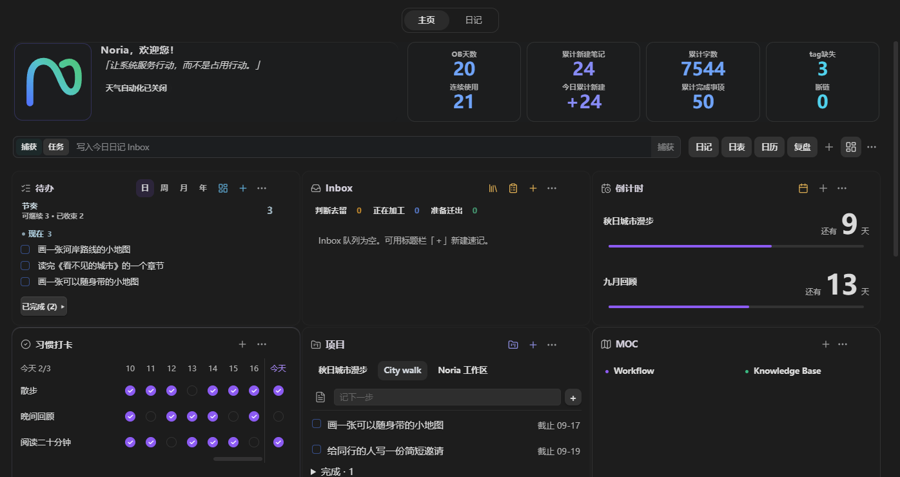

### 2.1 首屏结构

默认首屏按以下顺序组织：

1. 身份、名言、天气和概览指标。
2. 捕捉、任务输入和“继续推进”。
3. 待办、Inbox 与倒计时三列工作卡。
4. 项目和 MOC 导引。
5. 趋势统计与复盘中心。

默认顺序只是起点。每个主要卡片都可以作为一级小组件独立调整。

### 2.2 捕捉与任务输入

主页顶部提供两种输入：

- **捕捉**：写入今日日记的 Inbox，适合想法、线索和临时记录。
- **任务**：写入今日日记任务区域，适合已经明确需要执行的事项。

输入、模式切换、提交动作和右侧导航保持在同一水平线上。捕捉后不要求立即分类。

### 2.3 待办

主页待办默认按节奏组织，强调当前可做的事情，而不是持续展示截止压力。

- 未完成任务使用更明确的字重。
- 已完成任务正常显示，不使用强烈删除式视觉。
- 建议优先处理的任务自然排在前面并使用轻量标记，不额外生成建议框。
- 点击任务直接打开来源；悬停显示日期、标签、项目和来源等详情。
- 日、周、月、年范围切换继续保留。

任务无法完成时可以在第二天继续，不需要把延期本身设计成惩罚。

### 2.4 Inbox

Inbox 卡片显示当前队列、工作流分组和少量可继续处理的条目。右上角保留切换视图、打开队列和新增入口，导引区不再重复放置第二套 Inbox 卡片。

今日打卡和历史保留在独立习惯卡中。连续完成以相连色块呈现，断档处断开；部分记录与未记录分别显示。默认最近 21 天，**… → 卡片设置 → 显示天数**可选 7、14、21、30、60、90 天；窄卡横向滚动，名称固定，初始定位今天。点击日期格补打卡；点击习惯名称调整参数。

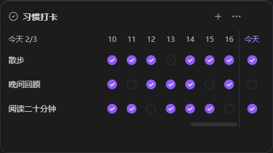

### 2.5 倒计时

显示“还有 n 天”，当天显示“就是今天”；主页只显示尚未到期的项目；已到期和已归档项目可在管理面板中查看。**+** 新增，点条目编辑名称、开始和截止日期。进度按实际开始、截止日期计算；没有开始日期的旧记录不显示虚构进度。

悬停或聚焦进度条末端可调整截止日期：向右提前、向左推迟，拖动时显示拟定日期，松开保存，Escape 取消。方向键微调，Shift 配合方向键调整一周。归档和恢复在管理面板中完成，原记录保留在倒计时 Markdown；任务来源的倒计时修改原任务。

### 2.6 项目与 MOC

- 点击项目选择其任务；“记下一步”旁的笔记图标打开项目主笔记，并保留当前项目和未提交输入。
- MOC 入口按网格对齐，随卡片宽度调整列数。小色点标识主题，同名 Canvas 使用独立图标。显示名称省略末尾 `·MOC`，源文件名保持原样。
- **+** 选择已有 Markdown 或 Canvas 文件；**… → 管理内容**调整顺序、颜色、路径或移除入口。移除入口会保留源文件。库内文件或文件夹改名后，已保存的入口路径会跟随更新；失效入口可以重新选择对应文件。

项目、MOC、工作流和队列的资料入口会保留主页，并复用已经打开的 Markdown、Canvas 或 Base 标签页。Ctrl/Cmd 点击或中键另开标签，Ctrl/Cmd+Alt 点击并排打开；悬停预览遵循 Obsidian 的“页面预览”设置。主页保留入口，不复制完整项目或知识正文。

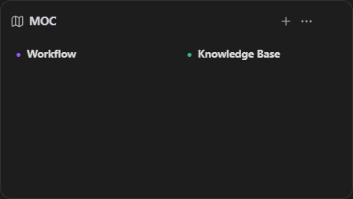

项目管理先显示名称和阶段，点一项再编辑。新增时可选择已有笔记，或明确选择“新建项目笔记”；输入错误的已有路径不会偷偷创建文件。隐藏、完成与移除入口均保留源笔记。

### 2.7 主页小组件

使用主页操作栏或日记工具栏的 **+** 添加卡片：内置功能、笔记 / Base、统计和可用的第三方组件。选择后配置并预览真实内容；隐藏的卡片也能从这里恢复。

每张卡右上角 **…** 将内容管理与布局操作分开：宽度示意、上下移动、折叠、自动高度、复制和隐藏。复制出的卡片拥有独立配置。并排卡片等高，底部拖动柄可调整高度；窄栏单列自然展开。主页布局独立；日、周、月、年分别共用各自布局，切日期只切内容。

Dataview 卡片选择包含查询的笔记，通过 Obsidian 原生插件详情安装或启用依赖。两个卡片可以使用不同笔记；停用依赖只影响相应卡片，重新启用后可恢复。笔记 / Base 卡片复用原生渲染。其他插件必须提供适配接口或可嵌入笔记内容；不保证任意完整插件界面都能嵌入。开发者见[卡片接口](../CARD-PROVIDERS.md)。

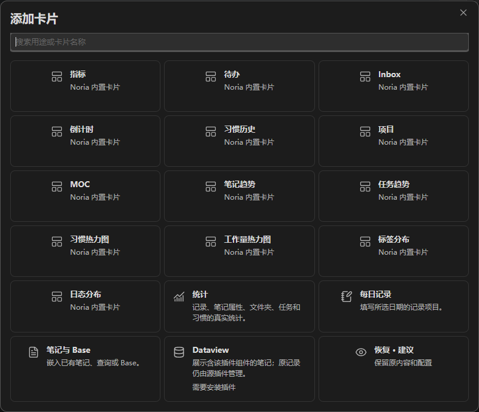

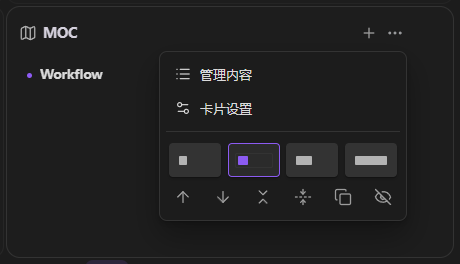

### 2.8 外部 Markdown 工作台

Markdown 小组件可以读取外部 Agent、RSS 流程或其他脚本生成的每日简报、当前建议、每周回顾和项目监控文件。Noria 负责展示、来源跳转和新鲜度提示，内容仍由对应外部流程生成。

## 3. 任务看板

任务看板把日记、项目和普通笔记中的 Markdown 任务组织成四种互补视图。任务始终保留在来源文件中。

### 3.1 月视图

用于观察月度任务分布、跨日任务、截止位置和一段时间内的工作密度。适合先看整体，再进入周或日视图安排时段。

任务多时，在对应周内上下滚动；同周任务一起移动，日期标题保持可见，跨日条连续显示。其他周不受影响。编辑或完成任务后保留查看位置；完成状态通过勾选与颜色标记表达，标题仍清晰可读。

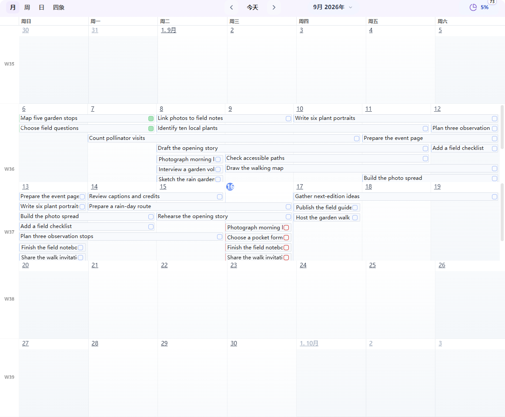

### 3.2 周视图

用于安排一周内的任务和时间段。并列任务会根据列宽和高度自适应标题与时间信息，空间不足时优先保留任务辨识度。

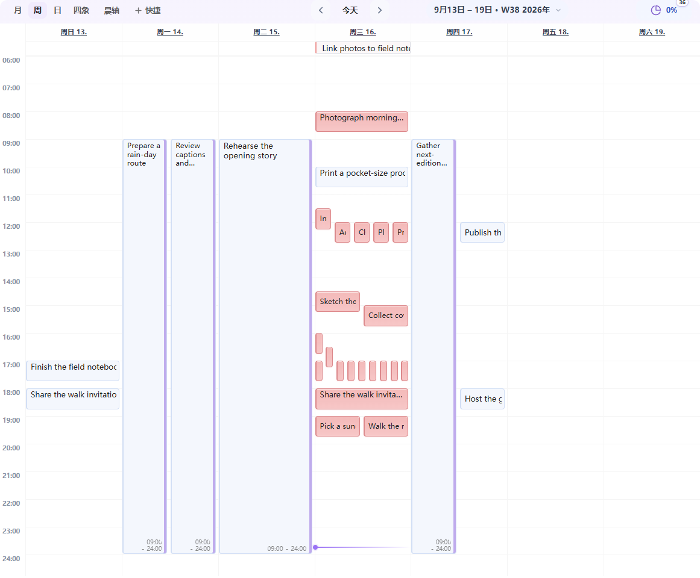

### 3.3 日视图

用于安排当天的具体时间。无时段任务和全天事项保持在顶部，具体时间任务进入小时网格。

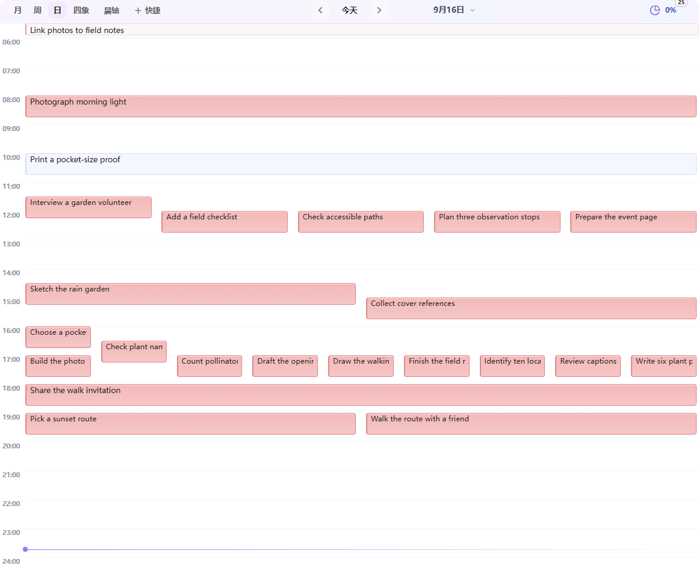

### 3.4 四象限

用于在任务较多时重新判断重要性和紧迫性。四个区域是同一任务池的不同组织方式，不会复制任务。

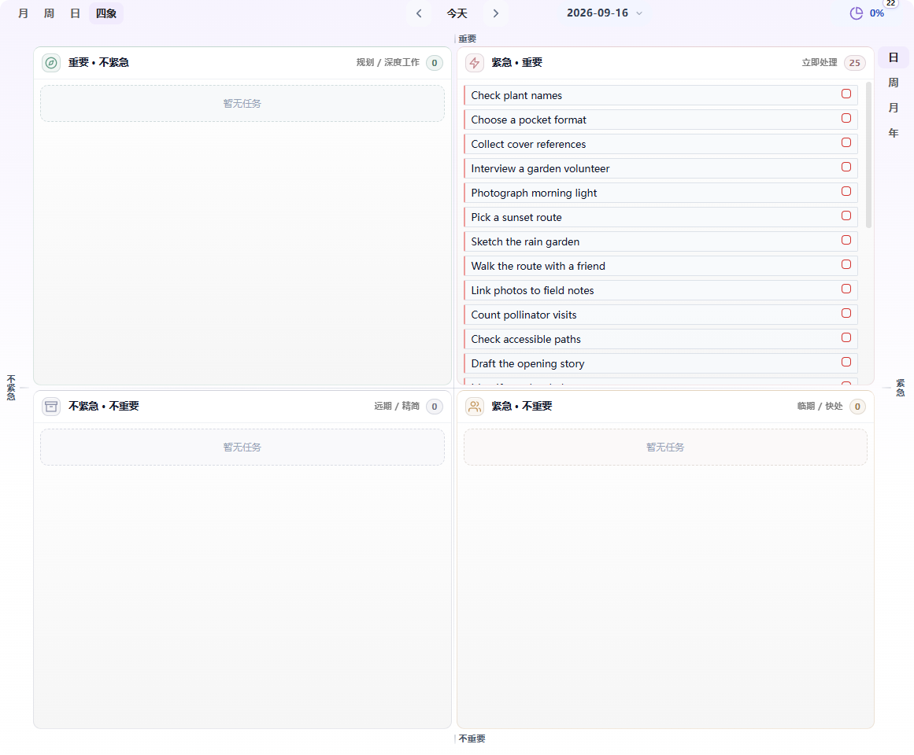

### 3.5 编辑任务

任务编辑器支持：

- 标题和标签；
- 优先级与状态；
- `start`、`scheduled`、`due`、`completion` 等日期；
- 开始和结束时间；
- 循环关系和前后依赖；
- 打开来源、保存和删除。

在任意 Markdown 笔记中，也可以把光标放在任务或普通文本行上，运行 **Noria: Edit or create task at cursor**。

主页、日记、看板和时间轴使用同一个编辑器。开始、计划、截止日期固定排列，年／月／日和时／分分别留出数字位置；直接输入时间不会弹出选择器，需要时点击时钟或按 `Alt+↓`。重复、依赖和生命周期日期按需展开。日期与时间可以留空；仅修改标题不会补日期，也不会自动移动另一端日期。保存后应用修改，关闭会在本次会话中保留输入，**放弃修改**才清除。

### 3.6 创建周期笔记

点击日期进入工作台的对应日记，首次保存才创建缺失的笔记。目标目录和模板来自当前路径配置。季度笔记以及关闭主页模块时的原生笔记入口，沿用日历的创建确认设置。

## 4. 任务时间轴

任务时间轴是 Noria 自有的时间视图，用于观察任务在日期、时段和阶段中的关系；任务仍来自原始 Markdown，视图只负责组织、筛选和交互。

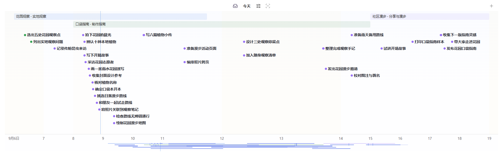

*本节介绍 Noria 0.4.6 的 Timeline，截图使用示例任务。*

### 4.1 主编辑区与侧边栏

- 主编辑区适合较长时间范围、图层筛选和批量观察。
- 侧边栏适合常驻查看当前节奏，标题会根据可用纵向空间自适应排列。

时间轴在 Obsidian 恢复工作区后应直接加载，不应要求先打开任务看板。

### 4.2 导航与尺度

- 点击**今天**回到当前日期。
- 普通滚轮横向平移时间。
- 拖动空白时间带进行平移。
- `Ctrl/Cmd + 滚轮` 缩放。
- 拖动底部日期行或缩略图均可平移；聚焦该区域后，方向键平移，`+` / `-` 缩放。

日期与缩略图共用一个连续的底部区域，只保留一排日期。小时尺度下，仅首处刻度和跨日位置补充日期；缩略图中较亮的片段表示当前可见范围。

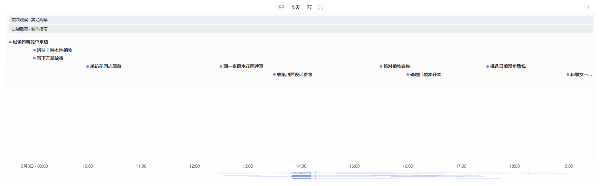

### 4.3 任务视觉与写回

不同项目的任务保持混排。圆点与短标题标识任务，额外详情在交互时出现：

- 所有任务统一显示圆点与其后的短标题，按开始时间定位；开始时间早于窗口的任务停靠左沿；
- 悬停或聚焦后显示完整时间、持续轨线与来源详情，区间手柄只在交互时出现；
- 圆点颜色表达完成状态，已完成标题保持与未完成标题相同的颜色和字重；
- 空间足够时尽量显示完整标题，冲突时再截断；
- 点击标题或圆点定位到 Markdown 中的原任务；
- 拖动任务或区间边界会写回原任务行。

写回前会检查来源指纹；来源已经变化时拒绝覆盖。

### 4.4 图层与筛选

可以选择任务、标记、笔记、Git、Noria 和番茄钟等图层。番茄钟默认关闭。

筛选支持：

- 显示或隐藏完成任务；
- 文本查询；
- 仅显示指定标签；
- 排除指定标签。

筛选只改变观察方式，不修改任务。

### 4.5 命名视图

常用时间轴状态可以保存为自定义命名视图，内容包括：

```text
名称、时间中心、显示尺度、图层、完成态、查询、包含标签、排除标签、标记模式
```

视图状态变化后显示“已修改”，只有显式更新才覆盖已保存视图。

### 4.6 时间标注

1. 点击工具栏的**框选时间标注**，在主区域空白处拖动以预览时间范围，也可以按住 `Shift` 拖动。
2. 填写名称，选择已在主页登记的项目或**全局时段**，调整时间与颜色。
3. 点击**保存**保留标注，点击**取消**或按 **Escape** 放弃草稿；随后恢复普通平移。

标注以紧凑阶段带显示在混排任务上方，项目标注显示为**项目名 · 阶段名**。重叠时最多显示两行，其余可通过**更多阶段**打开。点击阶段名称可编辑或删除；编辑期间拖动端点只改变草稿，点击**保存**才保留，按 **Escape** 取消。标注不会修改任务日期，也不代表新增任务或已经投入的工时。

## 5. 日历与日记

工作台顶部提供常驻的**主页 / 日记**入口，日记内通过**记录 / 复盘**切换。两种模式共用当前周期、日期和 Markdown。以下更新当前随本地体验包提供。

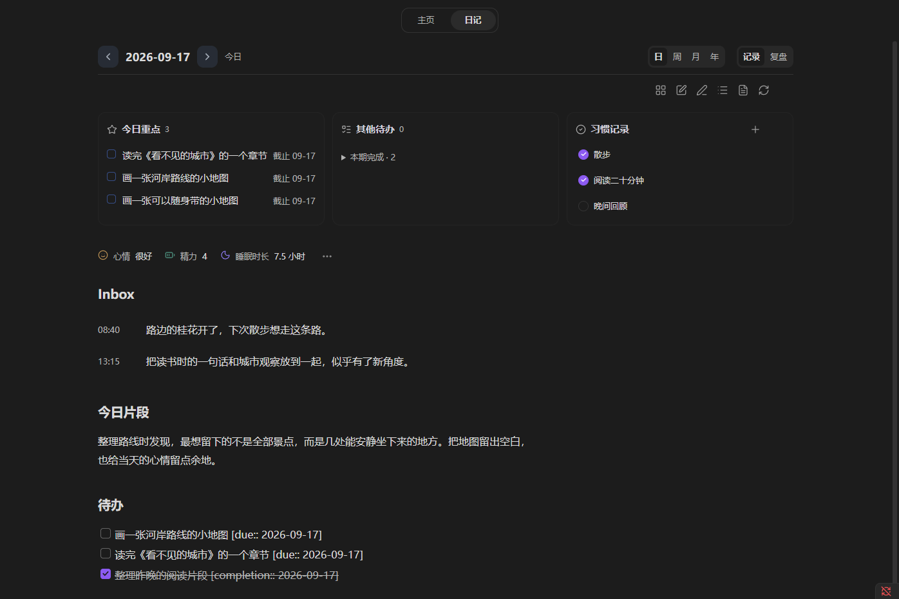

点日期标题临时打开原有日历；选择**在侧栏打开**可保持日期导航。侧栏日历已显示时，日期标题直接使用它。任务看板、时间轴和普通笔记保留独立打开的方式。

### 5.1 主要操作

- 悬停卡片或将键盘焦点移入卡片，右上角 **…** 可选窄块、标准、宽块、整行，也可移动、折叠或还原卡片布局。窄窗格会自动减列。布局归当前工作台，切换日期和重新打开后保留，调整不改动笔记内容。
- 日、周、月、年按钮围绕所选日期切换周期。点日格保留当前周期与记录/复盘模式，点周号则明确进入对应周。
- 点击月份或年份浏览，可用前后箭头切换年份范围，再选日期；浏览本身不改变书写目标。进入对应月记或年记，使用日记顶部的月、年切换。
- **今日 / 本周 / 本月 / 本年**回到真实当前周期。选定日期后收起临时日历，并恢复键盘焦点。
- 日期前后箭头与任务面板使用同款控件。铅笔/书本图标以及 Obsidian 阅读/编辑切换命令、当前快捷键均可切换模式。列表、文件和刷新图标分别进入目录、源笔记和重新读取；悬停或聚焦可查看说明。
- 已有笔记先阅读；缺失日期显示配置中的模板，可直接书写。改动自动保存，保留编辑器、选择与滚动位置；`Ctrl/Cmd+S` 可立即保存。
- 切换主页、日记和复盘时保留草稿、光标与页面滚动位置。关闭后可恢复未提交的正文及目标日期。

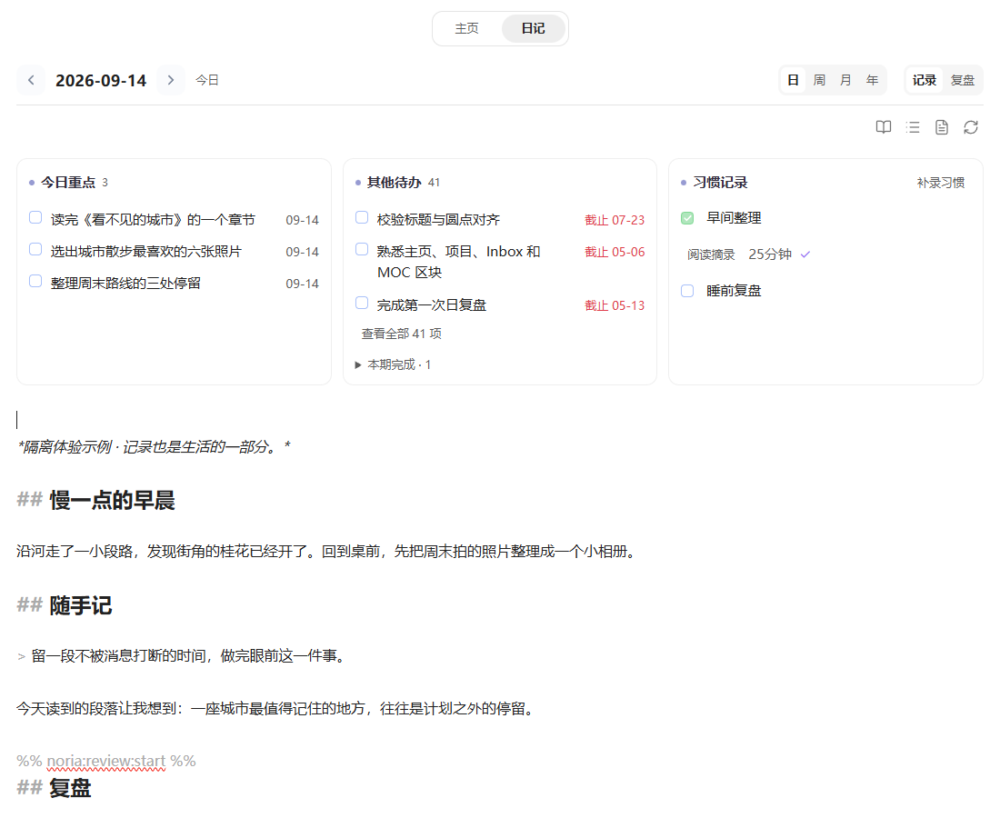

*本地体验中的编辑状态，正文为示例内容。书本图标返回阅读，正常书写无需另点保存。*

### 5.2 创建行为

浏览、聚焦或离开未经修改的模板不创建文件。首次文字改动会自动保存到所选日期；先打卡或快速记录，也会使用同一配置模板创建。缺失文件的源笔记图标可以按日历创建设置明确建档并打开原文。切换日期或阅读模式时，会将待保存输入写回原目标。已有空文件或只有属性的文件保持现状，不会自动套回模板。

新的内置日、周、月、年模板从**记录、计划**开始，Inbox、习惯记录和复盘在使用时加入。既有自定义模板保持，日期变量使用所选周期，补写过去记录也如此。可以增删或重排标题。`cssclasses: [daily-clean]` 限定日期笔记的排版，继承主题与字体。行动区聚合原有来源中的当期任务和此前未完成任务；点击标题打开共用的紧凑编辑面板，其中的源笔记图标定位到原任务行；勾选框完成或重开原任务。动态三件事只在真实当前周期出现。正文预览中的 Markdown 复选框仍只读。

日记与主页的习惯操作写入配置中的当天笔记；定义留在 Habits.md，数值型记录保存实际值与当时目标。过去日期展示已有记录并提供明确补录，未来日期不能打卡。记录习惯也会创建尚不存在的日记。周、月、年显示任务、打卡和字数概览，需要时打开完整统计。

正文编辑中也可以勾选任务或记录习惯。与正文改动互不重叠的记录会接续到草稿，原处也有修改时仍需核对。习惯原行中的备注、标签和块链接会保留；目录在阅读和编辑中均可按当前标题跳转。

保存失败或原文在外部改变时，编辑器保留输入，就近提供重试、复制和恢复动作。重新打开的恢复正文先供检查，继续编辑或选择**使用这份草稿**后才恢复保存，不能仅因打开便覆盖原文。复盘沿用相同保护，详见[保存保护](#85-保存保护)。

安装不重写已有模板、旧视图块或历史笔记。旧 `focusPanel`、`habitCheckin` 习惯入口也写入对应日期笔记，支持撤回和实际数值；没有明确日期时不打卡。原清单中的旧打卡继续可读，同一习惯同一天的日期笔记记录优先，包括撤回。历史迁移需先查看具体差异，重复记录保留原文核对。季度笔记与关闭主页模块后的原生入口，继续按日历设置创建和确认。

日期预设在阅读与 Live Preview 中使用一致的标题层级。插件内维护这份样式；若原库另启用了旧版 `daily-clean` CSS 片段，可在外观设置中停用该片段后使用插件预设，片段文件可以保留。

### 5.3 日期来源

日历支持三种来源：

- **Noria**：使用“总览 → 路径”中的 Diary root 与模板。
- **Daily Notes**：读取 Obsidian Daily Notes 配置。
- **Custom**：单独指定目录、命名格式和模板。

界面只显示当前来源需要的字段，避免同时出现多套互相竞争的目录设置。

### 5.4 随手记与日态

日记的**记录**页中，方框铅笔图标打开所选日的随手记。主页捕捉与 **Noria：随手记**命令写今天，可在 Obsidian 中自行分配快捷键。输入区明确显示目标日期；周、月、年页不会悄悄写入某天日记。

回车换行，`Ctrl/Cmd+回车`保存。链接、段落与缩进保留在 Markdown 的 `## Inbox` 下。今天的记录附上时间；补写过去或未来日期时不自动虚构发生时刻，可以自行写明 `[HH:mm]`。阅读时用简洁的时间列呈现，有时间的记录在前、未标时间的在后，不重排源文件。

首次记录使用所选日配置的模板。切换日期保留未写完的输入；保存失败保留文字供重试。正文的独立改动继续保留，尚未解决的冲突会阻止追加。记录本身不会创建任务，需要时再选中文字主动采纳。

每日正文旁的心情、精力使用原生菜单，清除即取消该值；专注可从 **…** 按需填写，已有天气只作背景。向空白日期填写日态，同样采用该日的模板。


*体验包中的示例内容。*

## 6. 习惯

习惯系统把“今天是否完成”和“长期是否形成”分开呈现。

### 6.1 今日习惯

主页 Inbox 卡片下方可以显示今日习惯入口。这里负责快速打卡，不重复历史图表。

### 6.2 习惯卡片

完整习惯卡片显示习惯名称、日期列和打卡状态。习惯名称复用 MOC 卡片的标题字号与字重，保持全插件文字层级一致。

支持：

- 勾选型习惯；
- 数值型习惯；
- 目标值和单位；
- 新增、编辑、暂停和标记已养成；
- 从 `#tl/sleep` 刷新睡眠习惯。

### 6.3 历史与热力图

主页固定显示习惯名称和今天的操作列，中间历史横向滚动；所选范围包含今天且只显示一次，默认 21 天，**… → 卡片设置 → 显示天数**可改为 7、14、21、30、60、90 天。历史格可以补记，并明确显示目标日期。

主页和日记共用勾选、数值及时间控件。数值与目标分开；保存失败保留输入。定义归习惯清单，实际记录归对应日期的 Markdown。改名保留历史关联，暂停或已养成不删除记录；修改目标不重算过去的打卡。

数值习惯可显式选择一个日记记录属性作为来源，一次填写供打卡和统计共用。热力图与周期汇总继续单独提供。

## 7. 趋势和统计

趋势和统计用于观察持续变化，不用于每天评价自己。

### 7.1 共享时间范围

所有统计卡片共享一套范围控制：

- 最近 30 天；
- 周；
- 月；
- 年；
- 自选范围。

### 7.2 笔记趋势

笔记趋势统计新建笔记数量和当前日记字数。字数表示当前文件内容，不等同于当天新增字数。

### 7.3 任务完成趋势

显示任务活动总量、完成量和完成率。没有完成日期的已完成任务保留在“无日期完成”中，不强行放入某一天。

### 7.4 习惯与工作量热力图

- 习惯热力图可以选择具体习惯或查看汇总。
- 工作量热力图把笔记、任务和字数等活动规范化为相对强度，不是精确工时。

### 7.5 笔记占比

笔记占比按知识库顶层目录统计，不按标签统计。它用于观察内容长期分布，而不是评价目录多少。

### 7.6 日态

心情和精力是可关闭、改名的预设。日记中的 **… → 记录项目**可以选预设、复用已有属性或新建项目，配置选项、等级、数值 / 单位或开关，以及图标和颜色。数值可直接修改，也可累加到当天合计；每天保存一个当前值。

日记记录采用按字段配色的紧凑按钮；点选后直接保存。主页“日常记录”默认对齐展示最多三项的日期变化：分类用色带，数值用独立刻度的趋势线。未记录保留空缺，不当作零；悬停或左右键选择日期，点击或回车进入当天日记。标题栏的筛选图标选择显示项目，“汇总与来源”按需查看分布、均值与原始记录。

内容保存在日期 Markdown 的原生属性中。停用不删除历史；改变显示名称不重命名属性。若单位或类型改变，应新建项目，避免改变旧值含义。复盘材料会带入对应周期已配置记录的名称、单位和值。

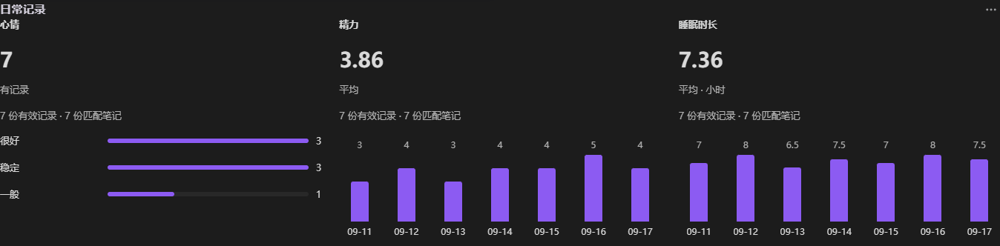

### 7.7 自定义统计卡

从记录项目选择“添加统计卡”，会带入属性；也可从卡片库选择“统计”，读取任意笔记文件夹及属性。选择范围、属性、计算方式和表现，预览会显示匹配量及实际结果。更多筛选中可设置子目录、标签、属性条件及分组。

支持数量、合计、均值、极值与分类分布，以及任务完成、习惯打卡。日记卡默认跟随当前周期，主页默认跟随共享范围，也可选择固定范围或不限时间。普通笔记的日期趋势必须明确使用事件日期属性或文件创建 / 修改日期；当前状态不能冒充历史变化。

缺失值与明确的零、否分开处理；类型或指定单位属性混杂时列出不能计算的来源。多选项按每个选项去重计数。点数字、条形或日期打开来源列表，再在新标签页打开原笔记。

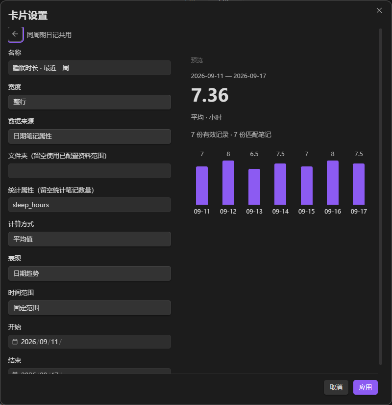

*配图使用隔离演示记录。卡片与可配置记录改进随当前体验构建提供，尚未正式发布。*

## 8. 复盘中心

从**日记 → 复盘**进入日、周、月、年回顾。记录与复盘切换时保留日期，共用同一份 Markdown；既有复盘命令仍能直接定位所需周期。本节更新随本地体验包提供，尚未正式发布。

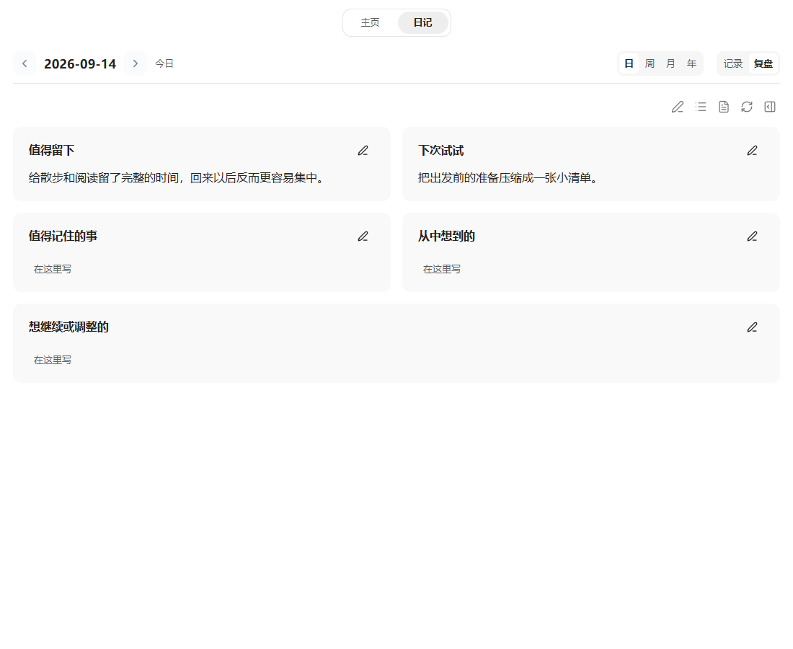

*配图使用示例内容。*

### 8.1 基本流程

1. 选择周期和目标日期。
2. 已有复盘先阅读，还没写的周期直接开始书写。
3. 点击分区旁的铅笔编辑这部分，或用**编辑全文**修改整篇 Markdown；两种方式处理同一份草稿。
4. 需要原始记录、下级复盘、证据或外部分析时打开**参考**。
5. 改动自动写回当前日期笔记，并保持编辑状态；切换参考日期不会改变这个保存目标。

### 8.2 阅读与编辑

分区跟随 Markdown 的真实标题层级与顺序，自定义标题和重复标题均可保留。短内容直接完整显示，长内容才提供**展开阅读**。宽栏最多让相邻两个短分区并排，窄栏使用一列；目录图标打开章节菜单，旁边保留源笔记、重新读取和参考图标，悬停或聚焦可查看说明。

编辑使用 Obsidian 的 Markdown 源码模式，支持标题、列表、链接、撤销/重做和 `Ctrl/Cmd+S` 立即保存。自动保存保留编辑器与光标，中文输入法完成组词后才写入。编辑一部分时，其余正文保持不动。**全部分区**和书本图标会处理待保存输入后返回阅读，也可使用 Obsidian 阅读/编辑切换命令及当前快捷键。普通误改使用撤销；需要修改复盘外层标题时，进入全文编辑。

**添加写作提纲**按需使用。可以改名、增删章节，只写几句连贯记录，也可以自行保留 GDD 作为反思提纲；不再要求固定填写亮点、偏差和阻塞。安装不会重写已有模板或历史笔记，自定义模板仍由你决定。心情、天气、能量和专注继续属于独立日态数据。

### 8.3 跨周期查阅参考

**参考 → 记录**在宽栏与正文并排，窄栏临时占用阅读区域；关闭后回到原编辑器和光标位置。

月复盘可以查看周回顾，再用**追溯原始记录**进入对应日记；年复盘可以参考月份或具体记录。缺少下级复盘时，仍可查看已有记录并继续写。日期沿用现有日记与日历路径。查看当天记录时，参考预览会略去当前正在处理的复盘，避免重复展示。

复盘预览中的任务只读，需要修改时打开源笔记。旧嵌入视图和笔记嵌入改为来源链接，避免片段中的控件按错误行号写入；普通图片仍可显示。

### 8.4 Evidence 与外部 Agent

Noria 准备本地 evidence JSON 和提示词，不在插件内调用模型。从**参考 → 分析**准备证据，运行自己的外部流程后，再刷新检查其生成的复盘笔记。

提示词指向 `.material.json`，其中保留原文、相关任务与日态事实、来源索引。完整 evidence JSON 继续供具体疑点核查。月材料优先使用已采纳的周回顾，年材料优先使用月回顾；缺少下级复盘时使用日记。供模型阅读的材料省略可执行视图块与重复统计，保留作者文字。

默认 skill 按具体主题组织，区分事实与解释，允许生活记录止于体会；篇幅随内容伸缩，不固定 GDD 或最低字数。只有影响重要判断的明确缺口才补读，不要求扫描全库、全部对话或每个项目的三件套。

已有安装可在复盘设置的**默认复盘 Skill → 安装**更新未改动的旧默认版本。自定义 skill 会保留；**重置**才会明确覆盖它。插件仍不调用模型，也不自动采纳生成结果。

**加入这部分**将选中的分析章节采纳到复盘中，保留已有文字，并自动保存结果；仅打开或刷新分析不会写入正文。采纳不会创建任务。只留下你愿意纳入复盘的内容；观察、感受和生活记录不必都转成行动。

### 8.5 保存保护

- 未保存内容进入恢复草稿；
- 目标笔记在外部发生变化时阻止覆盖；
- 外部分析由你主动采纳后才进入正文；
- 本人编辑自动保存，重新打开恢复草稿本身不会写回 Markdown。

恢复草稿所依据的原文仍一致时，会先展示未保存文字供检查；继续编辑或选择**使用这份草稿**后恢复保存。原文变化、旧版本草稿无法安全核对，或同一周期另有未处理草稿时，通过**草稿（n）**选择查看、复制或使用；**舍弃这份草稿**只处理当前选中的一份。

保存发生冲突时，**保留草稿并重载原文**可以先保住本地内容，再载入最新原文进行整理。保存成功只清理本次已处理的草稿，其他窗口或尚未处理的内容继续保留。复盘的硬换行、缩进和代码围栏参与保存与冲突比较；日期和周期不一致的输入会被拒绝。

首次保存会用一对在阅读模式中隐藏的注释绑定完整复盘。编辑源文件时保留这两个标记，其中的标题可自由改名：

```markdown
%% noria:review:start %%
## 这个月的几件小事

### 值得记住的事

自己的文字。
%% noria:review:end %%
```

标记缺失、重复、旧复盘标题不唯一或代码围栏未闭合时，会阻止保存。通过**打开来源**修复原文后再刷新；复盘范围外的内容保持不动。

### 8.6 从记录或复盘采纳任务

阅读或编辑日记、复盘时，选中一段文字，用右键菜单或 **… → 从所选文字创建任务**，也可选择**关联到已有任务**。两个动作同时提供 Noria 命令，可在 Obsidian 中分配快捷键。

新建时，在同一任务编辑器中调整标题，通过**保存到**选择项目已有任务笔记或采纳当天的日常任务；日期可以留空。关联已有任务只补充出处，原任务的标题、状态和排期保持。所选文字本身已经是任务时，直接打开该原任务。

原文完整保留，任务下方用普通 Markdown 链接和引用保存出处。保存后继续原来的阅读或编辑；成功提示中的**查看任务**可以打开任务，任务编辑器中的**回看记录**图标返回对应日记或复盘。再次从同一段文字操作，会提供已有任务，并保留明确另建一条的选择。

关闭任务编辑器会在本次会话中保留输入，**放弃修改**才清除。记录的恢复稿或冲突、已经变化的原段落需要先处理；采纳动作不会代你确认恢复稿。

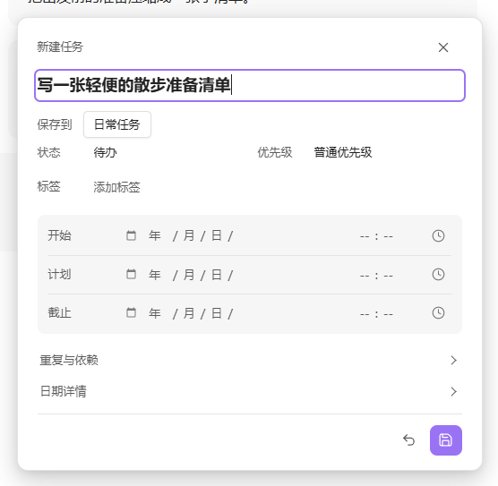

## 9. 设置

Noria 设置按七页组织。

### 9.1 总览

用于初始化和检查工作区：

- 标准工作区与自定义路径；
- 缺失文件和目录；
- 路径组；
- 模块开关；
- 查询范围与性能；
- 初始化、修复和打开入口。

### 9.2 主页

用于配置：

- 显示名称、称呼、头像和名言；
- 一级主页小组件；
- MOC 入口；
- Inbox 工作流；
- 复盘提示词；
- 天气。

主页只保留一个统一小组件管理器，不再同时显示旧首屏、工作台和趋势管理器。

### 9.3 任务

用于配置任务看板打开方式、扫描范围、包含与排除标签、状态策略和高级查询。

### 9.4 时间轴

用于配置打开位置、拖动步长、默认图层、完成态、尺度、命名视图和上下文刻度。

### 9.5 日历

用于选择 Noria、Daily Notes 或 Custom 日期来源，并设置创建确认、创建后打开、今日高亮和周期模板。

### 9.6 外观

用于调整界面密度、主题跟随、状态色、标签色和规划器细节。外观设置优先使用可见的语义选项，不要求普通用户编辑原始 token。

### 9.7 维护

用于：

- 检查 Noria 安装；
- 保存故障排查报告；
- 导出和导入设置备份；
- 查看 SecretStorage 状态；
- 管理可信自定义 JavaScript view；
- 展开开发者诊断。

## 10. Markdown、数据与外部工作流

### 10.1 数据边界

| 层级 | 内容 | 定位 |
| --- | --- | --- |
| 内容层 | 笔记、任务、项目、日记、习惯、倒计时 | 以 Markdown 或 Base 为准 |
| 配置层 | 路径、模块、主页布局、视图偏好 | 插件 `data.json` |
| 派生层 | 统计快照、复盘 evidence | 可重新生成的辅助数据 |
| 恢复层 | 未保存复盘与保留的冲突草稿 | 人工输入，不能重新生成；仅在保存成功或明确舍弃对应内容后清理 |
| 凭据层 | 天气服务密钥 | Obsidian SecretStorage |

Noria 不会把知识库转换成私有数据库。停用插件后，普通 Markdown 内容仍可阅读和编辑。

### 10.2 任务

Noria 识别标准 Markdown 任务：

```markdown
- [ ] 整理论文实验结果 [start:: 2026-08-04] [due:: 2026-08-07]
- [x] 完成初稿 [completion:: 2026-08-03]
```

任务可以包含 `start`、`scheduled`、`due`、`completion`、`created`、`cancelled` 和优先级等信息。看板、时间轴和日历编辑同一来源行。

### 10.3 时间轴事件

带 `#tl/` 标签和时间字段的任务可以进入时间轴。事件模板保存在 `Event library.md`：

```markdown
- [x] 深度工作 [default_tag:: #tl/focus] [default_start:: 09:00] [default_duration_min:: 90] #tl/template
```

### 10.4 习惯、项目与倒计时

- `Habits.md` 维护进行中、暂停和已养成习惯。
- `#habit` 任务默认不混入普通待办。
- `Projects.md` 使用分组和 wikilink 维护项目入口。
- `Countdowns.md` 使用 Markdown 表格保存重要日期。
- `Inbox workflow.md` 记录处置规则，`Inbox queue.base` 提供队列视图。

### 10.5 日记与复盘

日、周、月、年笔记仍是普通 Markdown。日记与复盘读写同一份日期笔记，任务列表和统计由工作区提供。旧笔记和模板中的视图块仍可使用。

### 10.6 外部内容进入主页

Markdown 简报来源使用：

```text
名称 | 路径 | 角色 | 新鲜度小时数
```

例如：

```text
每日简报 | Noria/Inbox/daily-brief.md | daily | 36
当前建议 | Noria/Inbox/current-suggestions.md | current | 72
```

可用角色包括 `daily`、`current`、`weekly`、`project` 和普通笔记。

### 10.7 外部 Agent 协作

1. 外部 Agent 读取指定 Markdown、复盘 evidence 或 Noria JSON 导出。
2. Agent 把简报、建议、项目监控或复盘结果写入约定文件。
3. Noria 展示这些内容并保留来源跳转。
4. 涉及日记和复盘正文时，由用户确认后写回。

### 10.8 安全边界

- 自定义 JavaScript view 默认关闭；
- 只运行显式信任的库内相对路径；
- 禁止协议地址、绝对路径和路径穿越；
- Noria 不静默移动笔记、重组目录或改写无关正文。

## 11. 常用工作流

Noria 不要求每天完整使用所有模块。

### 11.1 开始一天

1. 打开主页查看“继续推进”和当前项目。
2. 在待办卡片中选择当前节奏下适合处理的任务。
3. 查看今天的习惯和临近倒计时。
4. 需要安排具体时段时，再进入任务时间轴或日历。

### 11.2 随手捕捉

- 主页“捕捉”或 **Noria：随手记**命令写今天；日记中的随手记图标写当前所选日。
- 已经明确可执行的事项使用“任务”。

### 11.3 处理 Inbox

默认工作流只有三个可配置阶段：

- **待处理**（`triage`）：判断材料该变成什么，或者是否继续保留。
- **整理中**（`processing`）：精炼、拆分或并入其他内容。
- **待移出**（`ready`）：去向和下一步已经明确。

主页默认显示“待处理”“整理中”和“待移出”。“到期回看”和“补证据”只是可选分组，不是阶段。具体处理仍按以下顺序判断：

```text
delete → merge → split/refine → file/archive → defer
```

处理完成不是第四个状态。删除、合并、迁出或归档成功后，条目直接离开 Inbox。`defer` 表示暂时保留，状态仍属于“待处理”，不单独建立默认阶段。只有确实存在回看日期时才填写 `inbox-review`。内容离开 Inbox 后，应清除临时 `inbox-*` 字段。

### 11.4 使用任务看板

- 月表看长期分布；
- 周表安排近期节奏；
- 日表处理当天时段；
- 四象限重新判断优先级。

### 11.5 使用任务时间轴

1. 用今天、滚轮、空白拖动或底部导航定位范围。
2. 选择图层、完成态和标签筛选。
3. 点击标题或圆点打开来源，悬停或聚焦查看详情。
4. 需要调整任务排期时，使用任务的交互手柄。
5. 需要表达阶段而不改变任务日期时，添加命名的项目或全局时间标注。
6. 将常用的时间中心、尺度、图层和筛选条件保存为命名视图。

### 11.6 推进项目与知识积累

1. 在主页的项目区找到一个项目。首次初始化后，可以先使用空白的 Noria 工作区，也可在项目管理中创建自己的项目。
2. 在 **记下一步** 中输入具体行动。任务写入项目既有任务笔记和任务章节；有多个可选任务笔记时再选择位置。添加后立即可见，写入失败保留输入。
3. 点击任务标题，使用与看板相同的编辑器调整任务和日期；标签、优先级、重复及依赖也在同一处。源笔记图标直接打开原任务行。日期可留空，关闭后本次会话中的输入仍保留。
4. 勾选即可完成，也能从已完成项重开；通过**查看全部**展开其余清单。任务看板与 Timeline 读取同一条原始任务，未排期任务只有在你安排日期后才进入对应时段。

阶段输出继续维护在项目笔记中，可长期复用的结论再连接到对应 MOC。

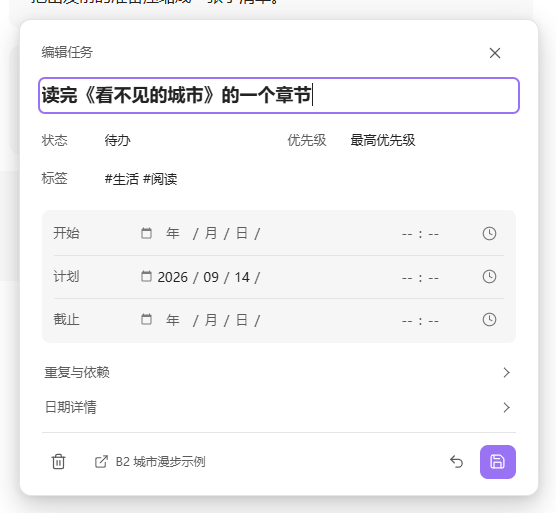

### 11.7 使用习惯和趋势

主页提供今日打卡和默认 21 天、可调整的历史；更大范围的习惯历史和热力图放在趋势区。趋势更适合周复盘和月复盘，不用于每天评价自己。

### 11.8 接收外部简报

外部流程生成 Markdown，主页显示摘要和来源。阅读后再决定是否转为任务、项目材料或长期笔记。

### 11.9 完成日复盘

打开当天，阅读已有内容或开始书写，就近修改需要调整的部分。提纲和外部分析按需使用，最后明确保存到同一天的笔记。

### 11.10 周期复盘与调整

查看任务、项目、习惯、日态和趋势证据，区分已完成、仍有价值、需要调整和应当停止的事项，只保留少量下一阶段重点。

### 11.11 最小使用方式

```text
主页捕捉 → 选择下一项任务 → 完成后更新 Markdown → 必要时复盘
```

## 12. FAQ 与故障排查

### 12.1 统一排查顺序

1. **入口**：模块是否启用，打开的是否为预期视图。
2. **来源**：Markdown 是否存在、已保存且格式正确。
3. **范围**：路径、扫描范围、日期和标签筛选是否包含目标内容。
4. **刷新**：先使用界面刷新或重试，再重新打开视图。
5. **诊断**：到“维护”运行安装检查并保存报告。

不要一开始就删除 `data.json`、重建全部文件或重装插件。

### 12.2 视图打开后空白

检查插件和模块是否启用、路径是否缺失、视图是否仍在延迟加载，再使用“重试”或重新打开。任务时间轴若每次重启都必须先打开任务看板，属于启动恢复故障。

### 12.3 任务没有显示

检查标准任务语法、来源保存状态、扫描范围、包含与排除标签、日期范围，以及当前视图是否隐藏完成、取消、无日期或习惯任务。

### 12.4 看板、时间轴和日历不一致

先比较日期范围、完成态、标签筛选和无日期任务策略。三者使用同一任务事实，但展示目标不同，不能只比较条目数量。

### 12.5 时间轴加载慢或不能操作

确认不是诊断空壳，缩小任务扫描范围，减少无关图层，并检查来源冲突。持续空白、滚轮无响应或只能通过重新执行命令恢复时，应作为故障报告。

### 12.6 文件创建到了错误目录

检查“总览 → 路径”中的 Diary、Inbox、Projects、模板和清单路径。“替换全部路径”会切换整套引用，使用前先查看预览。

### 12.7 主页小组件没有内容

检查组件是否启用、来源路径是否存在、文件是否为空、简报是否过期，以及组件是否被隐藏。Markdown 过期时不应继续伪装成当前信息。

### 12.8 统计结果与预期不同

检查共享时间范围、任务完成日期、笔记扫描范围、日记命名、习惯来源和文件保存状态。数据不完整不等于零。

### 12.9 复盘无法保存或没有更新

检查目标周期笔记和路径。外部 Agent 更新后点击刷新；出现来源冲突时先比较目标笔记，不要强制覆盖。

### 12.10 天气没有显示

新安装默认关闭天气。启用后选择位置或城市，按 provider 需要配置 SecretStorage 凭据，再手动刷新验证。

### 12.11 外部简报没有显示

检查目标 `.md` 是否生成、来源路径和角色是否正确、修改时间是否超过新鲜度，以及正文是否为空。

### 12.12 恢复设置

优先使用设置备份、补齐缺失路径、恢复单个模块默认值或重新生成缺失文件。只有明确需要清空全部设置时才删除 `data.json`。

### 12.13 报告问题

提供 Noria、Obsidian 和操作系统版本、模块、最短复现步骤、截图、维护报告和相关控制台错误。不要提交 API 密钥、完整私人日记或无关知识库内容。

## 附录 A：路径与数据存储

### A.1 标准工作区

| 用途 | 默认路径 |
| --- | --- |
| 时间轴设置 | `Noria/Timeline settings.md` |
| 事件模板库 | `Noria/Event library.md` |
| 倒计时 | `Noria/Countdowns.md` |
| 习惯清单 | `Noria/Habits.md` |
| 项目清单 | `Noria/Projects.md` |
| Inbox 工作流 | `Noria/Inbox workflow.md` |
| Inbox 队列 | `Noria/Inbox queue.base` |
| Inbox 内容 | `Noria/Inbox/` |
| 项目目录 | `Noria/Projects/` |
| 日记目录 | `Noria/Diary/` |
| 日、周、月、年模板 | `Noria/Templates/` |
| 头像与名言 | `Noria/avatar.svg`、`Noria/Quotes.md` |

标准初始化还可以创建 `Noria/Workflow·MOC.md` 和 `Noria/Knowledge Base·MOC.md`。当前版本不需要 `Noria/Home.md`，主页是插件视图。

### A.2 推荐的 IPARA 自定义映射

| 用途 | 推荐路径 |
| --- | --- |
| Noria 清单与工作流 | `02_Areas/Noria/` |
| Noria 模板 | `02_Areas/Noria/Templates/` |
| Inbox 内容 | `00_Inbox/` |
| 项目内容 | `01_Projects/` |
| 日记与周期笔记 | `06_Diary/` |
| MOC 入口 | `05_MOC/` |
| 头像与名言 | `02_Areas/Noria/` |

修改配置不会自动移动原文件。初始化只创建缺失内容。

### A.3 插件配置与缓存

```text
.obsidian/plugins/noria/data.json
.obsidian/plugins/noria/cache/stats/snapshots/
.obsidian/plugins/noria/cache/stats/tasks/
.obsidian/plugins/noria/cache/stats/review/
.obsidian/plugins/noria/cache/review/recovery-drafts.json
```

Markdown、Base、Canvas、模板和复盘笔记需要长期保留。统计缓存和 evidence 可以重新生成；`cache/review/recovery-drafts.json` 包含人工输入，不能按普通缓存删除。仓库安装脚本会保留现有 `data.json` 和 `cache/`。设置备份不等于恢复草稿备份，备份未保存内容时应包含该恢复文件。

### A.4 复盘路径

复盘最终稿位于对应日期笔记内，例如 `Noria/Diary/2026/2026-08-04.md`、`2026-W32.md`、`2026-08.md` 或 `2026.md`。日复盘跟随 Diary root，周、月、年使用各自配置的日历路径。

外部分析 artifact 是 Diary root 下的独立笔记：

```text
06_Diary/2026/2026-08-04-review.md
06_Diary/2026/2026-W32-review.md
06_Diary/2026/2026-08-review.md
06_Diary/2026/2026-review-month.md
06_Diary/2026/2026-review-week.md
```

标准工作区使用相同命名规则，只把根目录换成 `Noria/Diary/`。

### A.5 迁移与备份

迁移时优先保留用户内容、Noria 清单与模板、复盘笔记和设置导出。通常不需要迁移统计缓存；天气等 SecretStorage 凭据需要在新设备重新配置。

## 附录 B：高级与开发参考

### B.1 扩展边界

Noria 提供三类扩展方式：

1. Markdown 文件契约；
2. 版本化 JSON 导出；
3. 可信自定义 JavaScript view。

内部 DOM、CSS 类名、缓存实现、刷新 hook 和源码模块路径不属于稳定公共接口。

### B.2 自定义 JavaScript view

自定义 view 默认关闭。启用后，库内 JavaScript 会获得 Obsidian、Noria、`window` 和 `document` 的访问能力；它不是安全沙箱。

```js
const bridge = input.noriaBridge;
const result = await bridge.data.getSnapshot({
  preset: "home",
  range: { mode: "last30" }
});

const el = document.createElement("pre");
el.textContent = JSON.stringify(result.range, null, 2);
input.mount.appendChild(el);
```

只运行自己编写或已经审查的代码，并优先使用注入的 `input.noriaBridge`。

### B.3 公共 Data API

```js
bridge.data.resolveRange(request)
bridge.data.getSnapshot(request)
bridge.data.getTasks(request)
bridge.data.getTimelineAnnotations(request)
bridge.data.getTimelineTraces(request)
bridge.data.getPeriods(request)
bridge.data.getReviewEvidence(request)
bridge.data.export(request)
```

`data.invalidate()` 是内部刷新 hook，不作为公共接口承诺。

### B.4 范围与 preset

范围支持 `last30`、`week`、`month`、`year`、`custom` 和 `homeCurrent`。内置 preset 包括 `home`、`board`、`timeline`、`periodic`、`review` 和 `exportAll`。

### B.5 Snapshot

```json
{
  "meta": { "schemaVersion": 1, "request": {}, "resolvedRequest": {}, "policy": {} },
  "range": {},
  "granularity": "day",
  "domains": {},
  "views": {},
  "warnings": [],
  "sourceCompleteness": {}
}
```

调用方必须检查 `schemaVersion`、`warnings` 和 `sourceCompleteness`。

### B.6 任务事实与写回

任务身份由以下信息共同确定：

```text
sourcePath + line/blockId + fingerprint
```

写回必须定位原 Markdown、检查来源指纹、只修改目标任务行，并在来源变化时拒绝覆盖。渲染器本身不直接改写知识库。

### B.7 JSON 导出

```json
{
  "exportKind": "noria.snapshot",
  "exportVersion": 1,
  "exportedAt": "",
  "noriaVersion": "0.4.6",
  "payload": {}
}
```

支持 `noria.snapshot`、`noria.tasks` 和 `noria.reviewEvidence`。外部工具应根据 `exportKind` 和 `exportVersion` 解析。

### B.8 兼容性

扩展应检查 `bridgeVersion` 和数据 `schemaVersion`，对可选字段进行特性检测，不依赖内部属性顺序，不直接修改 `data.json`，也不读取或输出 SecretStorage 凭据。

### B.9 源码验证

```bash
npm ci
npm run build
npm test
npm run release:check
```

公开安装包只包含 `manifest.json`、`main.js` 和 `styles.css`。
