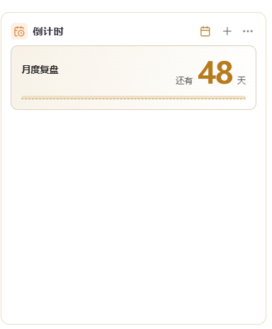
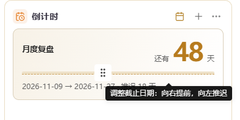
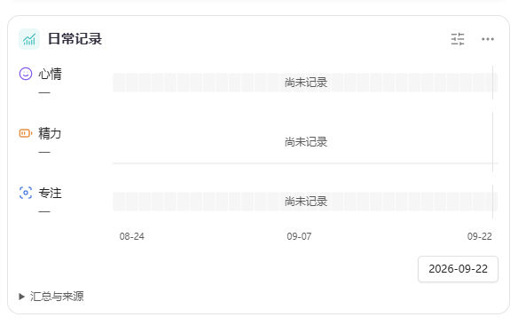
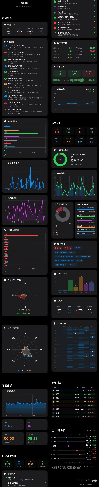
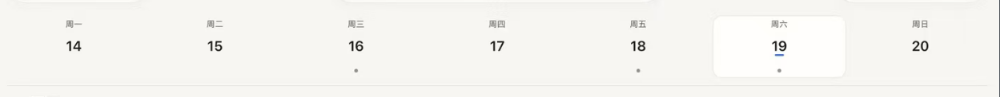

## 用户原图索引

编号对应用户本轮 13 张图。图片保持原文件字节；前 6 张为当前界面，后 7 张为参考图。

### 图 1 — 当前：主页天气

### 图 2 — 当前：主页工具栏

### 图 3 — 当前：倒计时

### 图 4 — 当前：倒计时拖动遮挡

### 图 5 — 当前：记录控件

### 图 6 — 当前：记录统计

### 图 7 — 参考：统计样式

### 图 8 — 参考：习惯行

### 图 9 — 参考：习惯配色与进度

### 图 10 — 参考：时间记录

### 图 11 — 参考：日期分组记录

### 图 12 — 参考：日期条

### 图 13 — 参考：竖向 Timeline

